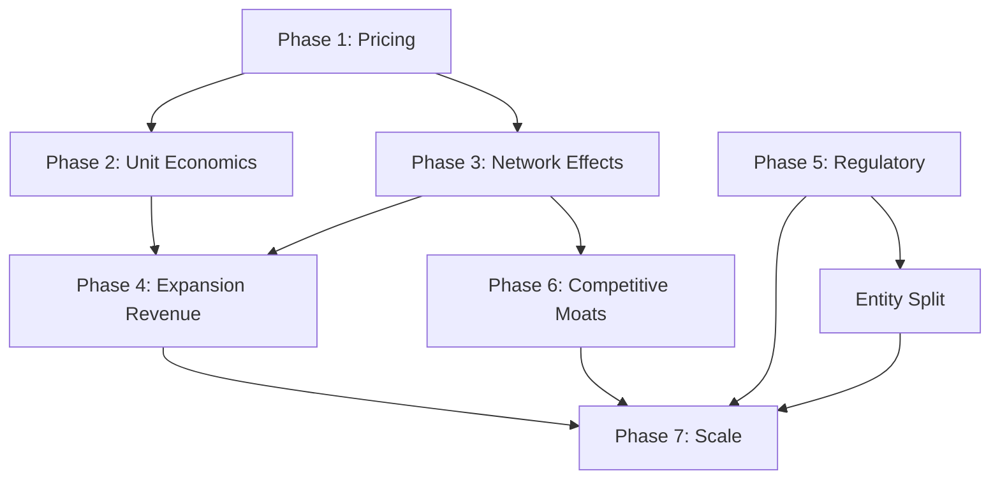

# Phase 7 — Implementation Roadmap & KPIs

## Overview
- Priority: High
- Status: Pending
- Duration: 1-2 days (synthesis)

## Context Links
- All prior phases (1-6)
- Current plan: `plans/260723-1827-complete-missing-features/plan.md`
- Master doc: `docs/master-consolidated-2026.md`

## 12-Month Roadmap

### Q3 2026 (Months 1-3) — Foundation
| Week | Phase | Deliverable | Owner |
|------|-------|-------------|-------|
| 1-2 | 1 | Pricing tiers API + 3 tiers/segment seeded | Backend |
| 3-4 | 1 | Volume discounts, contract terms, promo codes | Backend |
| 5-6 | 1 | Invoice integration, admin UI | Full-stack |
| 7-8 | 2 | Unit economics models + daily cron | Backend/Data |
| 9-10 | 2 | Cohort analysis, dashboard widgets | Full-stack |
| 11-12 | 3 | Referral program + matching events | Backend |

**Q3 Milestone**: Pricing live, unit economics visible, referral program launched

### Q4 2026 (Months 4-6) — Flywheel Acceleration
| Week | Phase | Deliverable | Owner |
|------|-------|-------------|-------|
| 13-14 | 3 | Matching service v1 (content-based) | Backend/ML |
| 15-16 | 3 | Network metrics dashboard, viral coefficient | Full-stack |
| 17-18 | 4 | Expansion product catalog (15 products) | Backend |
| 19-20 | 4 | Subscription billing + propensity scoring | Backend |
| 21-22 | 4 | Sales assist dashboard, upsell pipeline | Full-stack |
| 23-24 | 5 | Compliance risk register + checklist | Legal/Backend |

**Q4 Milestone**: Flywheel measured, expansion revenue >10%, compliance automated

### Q1 2027 (Months 7-9) — Moat Building
| Week | Phase | Deliverable | Owner |
|------|-------|-------------|-------|
| 25-26 | 6 | VST taxonomy (200 skills, 5 sectors) | Product/Data |
| 27-28 | 6 | Skill mapping for all programs | Backend |
| 29-30 | 6 | MOA template library (10 templates) | Legal/Product |
| 31-32 | 6 | Alumni tracker + re-hire analytics | Backend |
| 33-34 | 6 | Moat dashboard + quarterly assessment | Full-stack |
| 35-36 | All | Integration testing, performance optimization | Team |

**Q1 Milestone**: VST live, MOA time-to-sign <2 weeks, moat metrics tracked

### Q2 2027 (Months 10-12) — Scale & Optimize
| Week | Phase | Deliverable | Owner |
|------|-------|-------------|-------|
| 37-38 | 2 | Forecasting model (Monte Carlo) | Data |
| 39-40 | 3 | Matching v2 (collaborative filtering) | ML |
| 41-42 | 4 | LMI reports product, Scholarship fund mgmt | Product |
| 43-44 | 5 | EdCo/TechCo entity split, VAT automation | Legal/Finance |
| 45-46 | All | International pathway pilot (JITCO) | BD/Product |
| 47-48 | All | Board review, Series A prep | Founders |

**Q2 Milestone**: Expansion revenue >30%, forecasting MAPE <15%, Series A ready

## Key Performance Indicators (KPIs)

### Business KPIs (Monthly)
| KPI | Target Y1 | Target Y2 | Target Y3 | Source |
|-----|-----------|-----------|-----------|--------|
| **Schools Active** | 5 | 20 | 50 | Dashboard |
| **Enterprises Active** | 20 | 100 | 300 | Dashboard |
| **Learners Enrolled** | 500 | 3,000 | 10,000 | Dashboard |
| **Placements Completed** | 200 | 1,500 | 5,000 | Placements |
| **Monthly Revenue (VND)** | 2-4B | 15-25B | 50-80B | Invoices |
| **Expansion Revenue %** | 10% | 25% | 35% | Analytics |

### Unit Economics (Quarterly) — Research Targets
| KPI | School Target | Enterprise Target | Source |
|-----|---------------|-------------------|--------|
| **CAC** | < 50M VND | < 30M VND | Analytics |
| **LTV** | > 500M VND | > 300M VND | Analytics |
| **Payback** | **< 6 months (research: 4.2mo)** | **< 12 months with expansion (research: 9.5mo base)** | Analytics |
| **NRR** | > 110% | > 105% | Analytics |
| **Gross Margin** | > 70% | > 60% | Finance |
| **LTV/CAC** | > 5 | > 3 | Analytics |

### Flywheel Health (Monthly)
| KPI | Target | Source |
|-----|--------|--------|
| **Viral Coefficient (K)** | > 0.3 | Network |
| **Referral % of New Learners** | > 20% | Referrals |
| **Cross-side Matches/Month** | > 50 | Matching |
| **Matching Conversion Lift** | > 15% | Matching |
| **MOA Time-to-Sign** | < 14 days | MOAs |

### Moat Strength (Quarterly)
| KPI | Target Y1 | Target Y2 | Target Y3 |
|-----|-----------|-----------|-----------|
| **VST Coverage** | 50% | 75% | 90% |
| **Skill-Match Accuracy** | 65% | 75% | 85% |
| **Alumni Re-hire Rate** | 15% | 25% | 35% |
| **MOA Template Usage** | 30% | 60% | 80% |

### Compliance (Ongoing)
| KPI | Target |
|-----|--------|
| **Overdue Compliance Items** | 0 |
| **Risk Review On-Time** | 100% |
| **VAT Filing Accuracy** | 100% |
| **Data Audit Score** | > 95% |

## Resource Requirements

### Team (by Q2 2027)
| Role | Q3 2026 | Q4 2026 | Q1 2027 | Q2 2027 |
|------|---------|---------|---------|---------|
| Backend Engineers | 2 | 3 | 3 | 4 |
| Frontend Engineers | 1 | 2 | 2 | 2 |
| Data/ML Engineer | 0 | 1 | 1 | 2 |
| Product Manager | 1 | 1 | 1 | 1 |
| BD/Sales | 1 | 2 | 3 | 4 |
| Legal/Compliance | 0.5 | 1 | 1 | 1 |
| **Total** | **5.5** | **10** | **11** | **14** |

### Budget Estimate (VND Billions)
| Category | Q3 2026 | Q4 2026 | Q1 2027 | Q2 2027 | Total |
|----------|---------|---------|---------|---------|-------|
| Team | 1.5 | 3.0 | 3.5 | 4.5 | 12.5 |
| Infrastructure | 0.2 | 0.5 | 0.8 | 1.2 | 2.7 |
| Legal/Compliance | 0.3 | 0.5 | 0.5 | 0.5 | 1.8 |
| Marketing/BD | 0.5 | 1.0 | 1.5 | 2.0 | 5.0 |
| **Total** | **2.5** | **5.0** | **6.3** | **8.2** | **22.0** |

## Dependencies & Critical Path

**Critical Path**: Phase 1 → Phase 2 → Phase 4 → Phase 7
**Parallel Tracks**: Phase 3 & Phase 5 can run alongside

## Go/No-Go Gates

| Gate | Timing | Criteria | Decision |
|------|--------|----------|----------|
| **Gate 1: Pricing Live** | Week 6 | 3 tiers/segment, invoices auto-calculate, admin UI | Go/No-Go |
| **Gate 2: Economics Visible** | Week 10 | CAC/LTV dashboards, cohort accuracy >90% | Go/No-Go |
| **Gate 3: Flywheel Measured** | Week 16 | K-factor tracked, referral program active | Go/No-Go |
| **Gate 4: Expansion Revenue** | Week 22 | >10% revenue from upsells, pipeline >50 opps | Go/No-Go |
| **Gate 5: Compliance Automated** | Week 24 | Zero overdue, EdCo/TechCo modeled | Go/No-Go |
| **Gate 6: Moat Metrics** | Week 34 | VST live, MOA templates used, alumni tracked | Go/No-Go |
| **Gate 7: Series A Ready** | Week 48 | All KPIs green, 24-month runway, data room | Go/No-Go |

## Risk Mitigation Summary

| Risk | Phase Impact | Mitigation |
|------|--------------|------------|
| Pricing complexity delays launch | Phase 1 | MVP: 2 tiers only, add 3rd post-launch |
| Insufficient data for unit economics | Phase 2 | Bootstrap with benchmarks, refine monthly |
| Low network density kills flywheel | Phase 3 | Manual matching seed, heavy incentives |
| Expansion products cannibalize core | Phase 4 | Strict product review, clear boundaries |
| Regulatory change invalidates model | Phase 5 | Legal retainer, scenario planning |
| Moat investments don't compound | Phase 6 | Quarterly review, kill underperformers |
| Team scaling slower than plan | All | Contractor pipeline, remote-first hiring |

## Success Definition (12 Months)

**Must Have (All):**
- [ ] Pricing engine live with 3 tiers/segment + payment gateways + subscriptions
- [ ] Unit economics tracked daily, **payback <6mo (schools, research: 4.2mo), <12mo with expansion (enterprises, research: 9.5mo base)**
- [ ] Viral coefficient >0.3, **referral >20% of learners (target 50% by Y3)**
- [ ] **Expansion revenue >30% of total (research: ~50B VND Y3 target)**
- [ ] Zero compliance overdue items, **EdCo/TechCo VAT separation modeled**
- [ ] **VST taxonomy covering 80%+ placements (proprietary data moat)**
- [ ] Series A data room ready

**Nice to Have:**
- [ ] Matching v2 (collaborative filtering) in production
- [ ] **LMI reports generating platform revenue (research: 24B VND Y3)**
- [ ] **EdCo/TechCo legal split executed (tax optimization)**
- [ ] International pathway pilot (JITCO) launched
- [ ] MOA time-to-sign <10 days

## Next Steps

1. **Immediate** (This Week):
   - [ ] Review plan with co-founders
   - [ ] Assign phase owners
   - [ ] Set up project tracking (Linear/Jira)
   - [ ] Begin Phase 1 implementation

2. **Week 2**:
   - [ ] Sprint planning for Phase 1
   - [ ] Legal review of entity structure
   - [ ] Data infrastructure audit

3. **Month 1 End**:
   - [ ] Gate 1 review
   - [ ] Adjust Q4 plan based on learnings