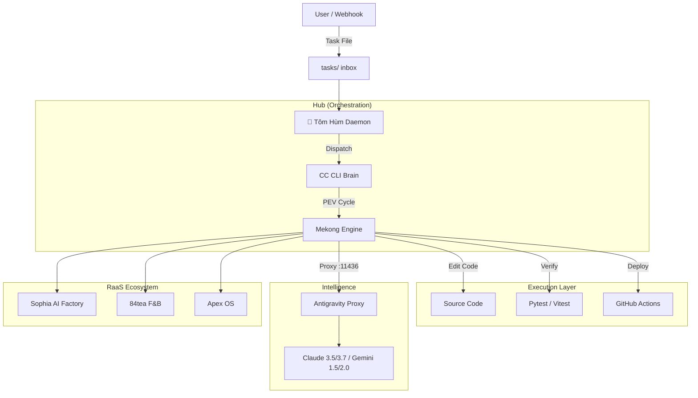

# 🌊 Mekong CLI — RaaS Agency Operating System

<div align="center">


**The Revenue-as-a-Service (RaaS) Foundation for Autonomous AI Agencies.**
Powered by **ClaudeKit DNA** & **Sun Tzu's Art of War (孫子兵法)**.

[🚀 Quick Start](#-quick-start) • [📦 Architecture](#-architecture) • [💎 Tiers](#-raas-foundation-tiers) • [🎯 Features](#-features) • [🤝 Contributing](#-contributing) • [🇻🇳 Tiếng Việt](README.vi.md)

</div>

---

## 📖 Introduction

**Mekong CLI** is the central nervous system of a **Revenue-as-a-Service (RaaS)** agency. It transforms traditional service models into autonomous outcome-based engines.

Inspired by the strategic depth of **The Art of War**, Mekong CLI orchestrates "armies" of AI agents (Fullstack, QA, Security, Marketing) to plan, execute, and verify complex engineering and business tasks with high precision.

## 🎯 Key Features

### 🧠 **Autonomous Execution Engine (PEV)**
The core **Plan-Execute-Verify** workflow ensures every task is handled systematically:
- **Plan**: Multi-step decomposition using specialized reasoning models.
- **Execute**: Multi-mode execution (Shell, API, LLM) with autonomous self-healing.
- **Verify**: Rigorous quality gates (Binh Phap) that enforce zero technical debt, type safety, and security standards.

### 🦞 **Tôm Hùm (OpenClaw Daemon)**
The "General" of your AI swarm, maintaining 24/7 readiness:
- **Autonomous Dispatch**: Watches `tasks/` directory to route missions to the most suitable agents.
- **Auto-CTO**: Proactively improves codebase quality when missions are idle.
- **Thermal Guard**: Specialized resource management for Edge devices (M1/M2/M3 MacBooks).

### ⚡ **Antigravity Proxy**
A unified LLM gateway (`port 11436`) providing:
- **Intelligent Load Balancing**: Spreads requests across multiple providers (Ollama, OpenRouter, Google AI).
- **Failover Autonomy**: Automatically switches models during quota exhaustion.
- **Cost Optimization**: Routes simple tasks to faster models while reserving high-reasoning tasks for Claude Opus.

---

## 📦 Architecture

Mekong CLI utilizes a **Hub-and-Spoke** architecture to ensure modularity and scalability:



---

## 💎 RaaS Foundation Tiers

Mekong CLI is built on a tiered foundation designed for both independent developers and enterprise agencies.

| Feature | **Free Tier** (Community) | **Paid Tier** (Enterprise) |
|---------|---------------------------|----------------------------|
| **Execution** | Local Edge Execution | High-Performance Cloud GPU |
| **Models** | Basic Models (Flash/Haiku) | Premium (Opus 4.5/4.6, DeepSeek R1) |
| **Agent Swarm** | Sequential execution | Massive Parallel Agent Teams |
| **Deployment** | Manual verification | 100% Automated Green Production |
| **Support** | Community GitHub Issues | 24/7 Dedicated RaaS Architect |
| **Advanced Tools** | Basic CLI tools | Custom Skills, Advanced CRM/Ads Ops |

---

## 🚀 Quick Start

### Prerequisites
- **Python**: 3.11+
- **Node.js**: 20+
- **pnpm**: 8+

### Installation

```bash
# Clone the repository
git clone https://github.com/longtho638-jpg/mekong-cli.git
cd mekong-cli

# Install all dependencies
pnpm install
pip install -r requirements.txt

# Configure your environment
cp .env.example .env
# Edit .env with your API keys
```

### Starting the Daemon

```bash
# Launch the Tôm Hùm Daemon
cd apps/openclaw-worker
npm run start
```

### Basic Commands

```bash
# Execute a mission
mekong cook "Fix the authentication bug in Apex OS"

# Plan a mission without executing
mekong plan "Create a 12-month roadmap for Sophia Video Bot"

# Check your agent's current status
mekong status
```

---

## 🤝 Contributing

We welcome contributions to the RaaS ecosystem. Please read our **[CONTRIBUTING.md](./CONTRIBUTING.md)** and **[Binh Phap Standards](./docs/code-standards.md)** before submitting a PR.

---

<div align="center">

**Mekong CLI** © 2026 Binh Phap Venture Studio.
*"In war, let your great object be victory, not lengthy campaigns."*

</div>
