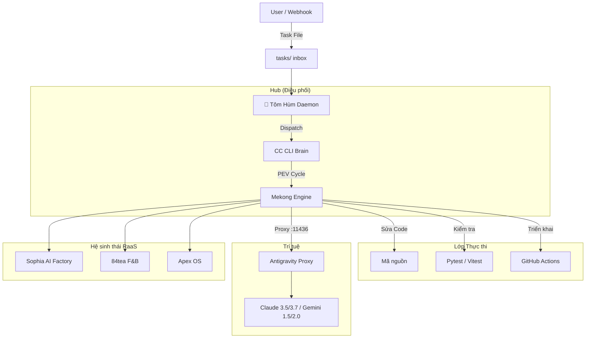

# 🌊 Mekong CLI — Hệ Điều Hành RaaS Agency

<div align="center">


**Nền tảng Revenue-as-a-Service (RaaS) cho các AI Agency tự trị.**
Vận hành bởi **ClaudeKit DNA** & **Binh Pháp Tôn Tử (孫子兵法)**.

[🚀 Bắt Đầu Nhanh](#-bắt-đầu-nhanh) • [📦 Kiến Trúc](#-kiến-trúc) • [💎 Các Gói Dịch Vụ](#-các-gói-raas-foundation) • [🎯 Tính Năng](#-tính-năng) • [🤝 Đóng Góp](#-đóng-góp) • [🌐 English](README.md)

</div>

---

## 📖 Giới Thiệu

**Mekong CLI** là hệ thần kinh trung ương của một **RaaS Agency**. Nó chuyển đổi các mô hình dịch vụ truyền thống thành các cỗ máy tự trị tập trung vào kết quả đầu ra.

Lấy cảm hứng từ chiều sâu chiến lược của **Binh Pháp Tôn Tử**, Mekong CLI điều phối các "đội quân" AI agent (Fullstack, QA, Bảo mật, Marketing) để lập kế hoạch, thực thi và kiểm tra các nhiệm vụ kỹ thuật và kinh doanh phức tạp với độ chính xác cao.

## 🎯 Tính Năng Nổi Bật

### 🧠 **Engine Thực Thi Tự Trị (PEV)**
Quy trình **Plan-Execute-Verify** cốt lõi đảm bảo mọi nhiệm vụ được xử lý một cách hệ thống:
- **Plan (Mưu)**: Phân rã đa bước sử dụng các mô hình suy luận chuyên biệt.
- **Execute (Thực)**: Thực thi đa chế độ (Shell, API, LLM) với khả năng tự sửa lỗi.
- **Verify (Chứng)**: Các cổng chất lượng (Binh Pháp) nghiêm ngặt giúp loại bỏ nợ kỹ thuật, đảm bảo type safety và tiêu chuẩn bảo mật.

### 🦞 **Tôm Hùm (OpenClaw Daemon)**
"Vị tướng" của đàn AI của bạn, duy trì trạng thái sẵn sàng 24/7:
- **Điều phối tự trị**: Giám sát thư mục `tasks/` để định tuyến nhiệm vụ đến các agent phù hợp nhất.
- **Auto-CTO**: Chủ động cải thiện chất lượng mã nguồn khi không có nhiệm vụ khẩn cấp.
- **Thermal Guard**: Quản lý tài nguyên chuyên biệt cho các thiết bị Edge (MacBook M1/M2/M3).

### ⚡ **Antigravity Proxy**
Cổng LLM tập trung (`port 11436`) cung cấp:
- **Cân bằng tải thông minh**: Phân bổ yêu cầu qua nhiều nhà cung cấp (Ollama, OpenRouter, Google AI).
- **Tự trị khi lỗi (Failover)**: Tự động chuyển đổi mô hình khi hết hạn ngạch (quota).
- **Tối ưu chi phí**: Định tuyến các tác vụ đơn giản đến các mô hình nhanh, trong khi dành các tác vụ suy luận cao cho Claude Opus.

---

## 📦 Kiến Trúc

Mekong CLI sử dụng kiến trúc **Hub-and-Spoke** để đảm bảo tính module và khả năng mở rộng:



---

## 💎 Các Gói RaaS Foundation

Mekong CLI được xây dựng trên một nền tảng phân tầng dành cho cả nhà phát triển độc lập và các agency quy mô lớn.

| Tính năng | **Gói Miễn Phí** (Community) | **Gói Trả Phí** (Enterprise) |
|-----------|------------------------------|-------------------------------|
| **Thực thi** | Thực thi tại Local (Edge) | Cloud GPU Hiệu Năng Cao |
| **Mô hình** | Mô hình Cơ bản (Flash/Haiku) | Cao cấp (Opus 4.5/4.6, DeepSeek R1) |
| **Đội ngũ Agent** | Thực thi tuần tự | Agent Teams Song Song Quy Mô Lớn |
| **Triển khai** | Xác minh thủ công | 100% Automated Green Production |
| **Hỗ trợ** | Cộng đồng GitHub Issues | Kiến trúc sư RaaS hỗ trợ 24/7 |
| **Công cụ Nâng cao** | Công cụ CLI cơ bản | Custom Skills, CRM/Ads Ops nâng cao |

---

## 🚀 Bắt Đầu Nhanh

### Yêu cầu tiên quyết
- **Python**: 3.11+
- **Node.js**: 20+
- **pnpm**: 8+

### Cài đặt

```bash
# Clone repository
git clone https://github.com/longtho638-jpg/mekong-cli.git
cd mekong-cli

# Cài đặt tất cả dependencies
pnpm install
pip install -r requirements.txt

# Cấu hình môi trường
cp .env.example .env
# Chỉnh sửa .env với API keys của bạn
```

### Khởi động Daemon

```bash
# Chạy Tôm Hùm Daemon
cd apps/openclaw-worker
npm run start
```

### Lệnh Cơ Bản

```bash
# Thực thi một nhiệm vụ
mekong cook "Sửa lỗi xác thực trong Apex OS"

# Lên kế hoạch không thực thi
mekong plan "Tạo lộ trình 12 tháng cho Sophia Video Bot"

# Kiểm tra trạng thái agent
mekong status
```

---

## 🤝 Đóng Góp

Chúng tôi hoan nghênh mọi đóng góp cho hệ sinh thái RaaS. Vui lòng đọc kỹ **[CONTRIBUTING.md](./CONTRIBUTING.md)** và **[Tiêu chuẩn Binh Pháp](./docs/code-standards.md)** trước khi gửi PR.

---

<div align="center">

**Mekong CLI** © 2026 Binh Phap Venture Studio.
*"Trong chiến tranh, hãy để mục tiêu lớn lao là chiến thắng, chứ không phải các chiến dịch kéo dài."*

</div>
