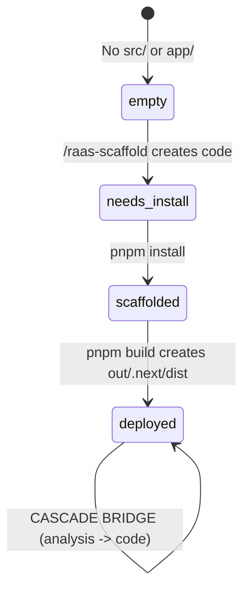

# Factory System Architecture v13.1

> CTO Brain v3 — State-aware dispatch with cascade bridge, ROI learning, output intelligence.

## Overview

The Factory System is an autonomous loop that dispatches commands to CC CLI panes running in tmux. It detects project state, selects the right command, monitors execution, classifies output, and learns from results.

## Architecture Diagram

```mermaid
flowchart TD
    FL[factory-loop.sh v13.1] --> HC{Health Check}
    HC -->|Dead| RS[Respawn Pane]
    HC -->|Alive| TO{Timeout Check}
    TO -->|Hung >10m| ESC[Escape + Enter]
    TO -->|OK| PS{Pane State?}

    PS -->|Crashed| RESTART[Restart CC CLI]
    PS -->|Queued| CLEAR[Escape]
    PS -->|Working| SKIP[Skip - wait]
    PS -->|Finished| OI[Output Intelligence]
    PS -->|Idle| DISPATCH[Dispatch Command]

    OI --> CLASSIFY{Classify Output}
    CLASSIFY --> LOG[Log to metrics]
    CLASSIFY --> LEARN[Update brain-learning-state.json]

    DISPATCH --> PQ[Priority Queue]
    PQ --> DPS{detect_project_state}
    DPS -->|empty| SCAFFOLD[/raas-scaffold]
    DPS -->|needs_install| INSTALL[/cook pnpm install]
    DPS -->|scaffolded| FEATURE[/cook feature N]
    DPS -->|deployed| CASCADE{Cascade Logic}

    CASCADE --> AO{analyze_output}
    AO -->|analysis_done| BRIDGE[CASCADE BRIDGE -> /cook]
    AO -->|fix| FIX[/cook fix errors]
    AO -->|bootstrap| BOOT[/studio-bootstrap]
    AO -->|continue| ROTATE[Command Rotation]

    ROTATE --> BP[BytePlus Brain]
    ROTATE --> RR[Round-robin fallback]

    FL --> WD[factory-watchdog.sh]
    WD -->|PID dead| FL
```

## Component Map

| Component | File | Purpose |
|-----------|------|---------|
| Main Loop | `factory-loop.sh` | 663-line bash script, main dispatch loop |
| Watchdog | `factory-watchdog.sh` | Auto-restart if loop crashes (checks PID every 60s) |
| ROI Calculator | `apps/openclaw-worker/lib/factory-roi-calculator.js` | Parse metrics, calculate ROI per project, manage brain state |
| Output Intelligence | `apps/openclaw-worker/lib/output-intelligence.js` | Classify CC CLI output (code/test/build/analysis/error) |
| Unit Tests | `tests/test_detect_project_state.sh` | 10 tests for project state detection |

## State Machine



## Key Functions

### detect_project_state(dir)
Checks filesystem to determine project lifecycle stage.
- `empty`: no `src/` or `app/` directory
- `needs_install`: has code but no `node_modules/`
- `scaffolded`: has code + deps, no build output
- `deployed`: has `out/`, `.next/`, or `dist/`

### analyze_output(output)
Reads CC CLI output to detect cascade triggers:
- `analysis_done`: report/analysis completed -> trigger /cook (CASCADE BRIDGE)
- `fix`: errors detected -> trigger fix command
- `bootstrap`: project not initialized -> bootstrap
- `continue`: normal rotation

### Priority Queue
Projects sorted by state before dispatch:
1. `deployed` (highest - productive projects first)
2. `scaffolded`
3. `needs_install`
4. `empty` (lowest - scaffold later)

### Brain Learning
On each command completion:
1. `save_pane_output()` saves latest output
2. `output-intelligence.js` classifies output type
3. `record_outcome()` updates `brain-learning-state.json`
4. `log_metric()` appends to `/tmp/factory-metrics.log`

On next dispatch:
1. `getBestCommand()` checks brain for best-performing command
2. `shouldAvoidCommand()` checks if command has failed repeatedly

## Data Flow

```
Dispatch → tmux send-keys → CC CLI executes → Output captured
    ↓                                              ↓
/tmp/factory-metrics.log              pane_state/pane_N_output
    ↓                                              ↓
ROI Calculator                        Output Intelligence
    ↓                                              ↓
brain-learning-state.json ←←←←←← record_outcome()
```

## Files Modified/Created

| File | Lines | Created |
|------|-------|---------|
| `factory-loop.sh` | 663 | v12.0 (2026-03-16) |
| `factory-watchdog.sh` | 35 | v13.1 |
| `factory-roi-calculator.js` | 170 | v13.0 |
| `output-intelligence.js` | 140 | v13.1 |
| `tests/test_detect_project_state.sh` | 95 | v13.0 |

## Commands

| Command | Description |
|---------|-------------|
| `/cto-dashboard` | Brain health, ROI scores, active missions |
| `/commands-status` | Dispatch stats from metrics log |
| `/factory-restart` | Safe restart without killing CC CLI |
| `/factory-intelligence` | Command effectiveness, output patterns |
| `/raas-scaffold` | Scaffold new SaaS project |
| `/raas-create` | Full pipeline: scaffold -> features -> deploy |

## Metrics Format

```
ISO_TIMESTAMP | event | pane | project | status | duration | command
```

Events: `factory_start`, `dispatch`, `command_complete`, `command_timeout`, `crash`, `respawn`, `unknown_state`, `factory_shutdown`, `watchdog_restart`

## Daily Digest

On shutdown, `write_daily_digest()` generates `plans/reports/factory-daily-{date}.md` with dispatch/success/timeout summary.
