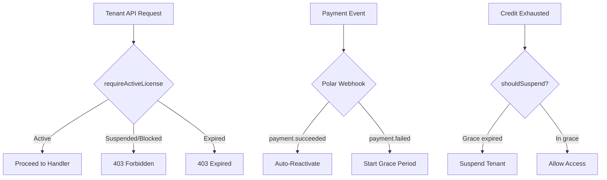
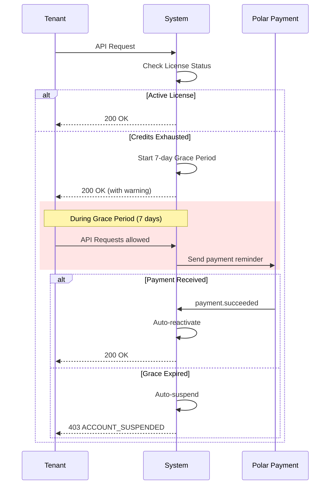

# RaaS Dunning System

## Overview
Automated license suspension and reactivation for tenant management in the Mekong Engine platform.

## Architecture



## Core Functions (dunning.ts)

| Function | Purpose |
|----------|---------|
| `checkLicenseStatus(db, tenantId)` | Get tenant license status (active/suspended/expired/blocked) |
| `suspendTenant(db, tenantId, reason)` | Suspend tenant access with audit log |
| `reactivateTenant(db, tenantId, newTier?)` | Reactivate tenant with optional tier change |
| `getDunningSchedule(db, tenantId)` | Get grace period timeline and suspension countdown |
| `shouldSuspendForCreditExhaustion(db, tenantId)` | Check if tenant should be auto-suspended |
| `emitLicenseEvent(db, tenantId, eventType, details)` | Emit webhook event for license changes |

### License Status Values

| Status | Description | API Response |
|--------|-------------|--------------|
| `active` | Tenant has valid license | 200 OK |
| `suspended` | Temporarily suspended (payment failed, credits exhausted) | 403 ACCOUNT_SUSPENDED |
| `blocked` | Permanently blocked (fraud, terms violation) | 403 ACCOUNT_SUSPENDED |
| `expired` | Tenant not found or deleted | 403 ACCOUNT_EXPIRED |

## Middleware (license-middleware.ts)

| Middleware | Purpose |
|------------|---------|
| `requireActiveLicense` | Blocks suspended/blocked/expired tenants from API access |

Usage:
```typescript
raasRoutes.use('*', requireActiveLicense)
```

## API Endpoints

Base URL: `/v1/raas`

All endpoints require authentication via `authMiddleware`.

### POST /suspend

Manually suspend a tenant.

**Request:**
```json
{
  "tenant_id": "550e8400-e29b-41d4-a716-446655440000",
  "reason": "Credit exhaustion - 7 day grace period expired"
}
```

**Response (200):**
```json
{
  "success": true,
  "tenant_id": "550e8400-e29b-41d4-a716-446655440000",
  "status": "suspended",
  "suspended_at": "2026-03-19T10:00:00Z"
}
```

### POST /reactivate

Reactivate a suspended tenant.

**Request:**
```json
{
  "tenant_id": "550e8400-e29b-41d4-a716-446655440000",
  "new_tier": "pro"
}
```

**Response (200):**
```json
{
  "success": true,
  "tenant_id": "550e8400-e29b-41d4-a716-446655440000",
  "status": "active",
  "tier": "pro",
  "reactivated_at": "2026-03-19T10:00:00Z"
}
```

### GET /license/status

Check current tenant's license status (uses auth context).

**Response (200):**
```json
{
  "tenant_id": "550e8400-e29b-41d4-a716-446655440000",
  "status": "active",
  "tier": "pro",
  "days_until_suspension": 5,
  "grace_period_ends": "2026-03-24T00:00:00Z"
}
```

### GET /dunning/schedule

Get detailed dunning schedule with grace period info.

**Response (200):**
```json
{
  "tenant_id": "550e8400-e29b-41d4-a716-446655440000",
  "status": "active",
  "days_until_suspension": 5,
  "grace_period_ends": "2026-03-24T00:00:00Z",
  "suspended_at": null,
  "reason": null
}
```

## Database Schema

### tenants table

```sql
CREATE TABLE tenants (
  id TEXT PRIMARY KEY,
  name TEXT NOT NULL,
  tier TEXT NOT NULL DEFAULT 'free',
  dunning_status TEXT,  -- 'suspended', 'blocked', NULL
  api_key_encrypted TEXT,
  created_at TEXT NOT NULL,
  updated_at TEXT NOT NULL
)
```

### credits table

```sql
CREATE TABLE credits (
  id INTEGER PRIMARY KEY AUTOINCREMENT,
  tenant_id TEXT NOT NULL REFERENCES tenants(id),
  amount INTEGER NOT NULL,
  reason TEXT,
  created_at TEXT NOT NULL
)
```

### webhook_events table

```sql
CREATE TABLE webhook_events (
  id INTEGER PRIMARY KEY AUTOINCREMENT,
  event_type TEXT NOT NULL,
  tenant_id TEXT,
  payload TEXT NOT NULL,
  created_at TEXT NOT NULL
)
```

### audit_logs table

```sql
CREATE TABLE audit_logs (
  id INTEGER PRIMARY KEY AUTOINCREMENT,
  tenant_id TEXT NOT NULL,
  action TEXT NOT NULL,
  resource TEXT,
  old_value TEXT,
  new_value TEXT,
  created_at TEXT NOT NULL
)
```

## Grace Period Logic



### Timeline

| Day | Event |
|-----|-------|
| 0 | Credits exhausted → Grace period starts |
| 1-6 | API access allowed, payment reminders sent |
| 7 | Grace period expires → Auto-suspend if no payment |
| 7+ | 403 on all API requests until payment |

## Polar.sh Integration

### Webhook Events

| Event | Handler | Action |
|-------|---------|--------|
| `payment.succeeded` | `handlePaymentSucceeded` | Auto-reactivate suspended tenant |
| `payment.failed` | `handlePaymentFailed` | Start grace period, send notification |
| `subscription.active` | `handleSubscriptionActive` | Ensure tenant status is active |
| `subscription.expired` | `handleSubscriptionExpired` | Start 7-day grace period |
| `subscription.canceled` | `handleSubscriptionCanceled` | Mark for suspension after grace |

### Webhook Endpoint

```typescript
// POST /webhooks/polar
// Verifies X-Polar-Signature header
// Processes event based on type
```

### Auto-Reactivation Flow

```typescript
async function handlePaymentSucceeded(db: D1Database, data: any) {
  const tenantId = data.metadata?.tenant_id
  if (!tenantId) return

  const status = await checkLicenseStatus(db, tenantId)
  if (status === 'suspended' || status === 'blocked') {
    await reactivateTenant(db, tenantId, 'pro') // Restore to paid tier
    await emitLicenseEvent(db, tenantId, 'license.reactivated', {
      trigger: 'payment_succeeded',
      payment_id: data.id,
    })
  }
}
```

## Error Codes

| Code | HTTP Status | Description |
|------|-------------|-------------|
| `ACCOUNT_SUSPENDED` | 403 | Account suspended - contact support or add credits |
| `ACCOUNT_EXPIRED` | 403 | Account expired - create new account |
| `INVALID_TENANT` | 400 | Tenant ID format invalid |
| `D1_NOT_CONFIGURED` | 503 | Database not available |

## Testing

Tests located in `packages/mekong-engine/test/`:

- `dunning.test.ts` - 21 test cases for core functions
- `license-middleware.test.ts` - 6 test cases for middleware

Run tests:
```bash
cd packages/mekong-engine
npm test
```

## Related Files

| File | Purpose |
|------|---------|
| `src/raas/dunning.ts` | Core dunning logic |
| `src/raas/license-middleware.ts` | License check middleware |
| `src/routes/raas.ts` | API route handlers |
| `src/raas/auth-middleware.ts` | Authentication middleware |
