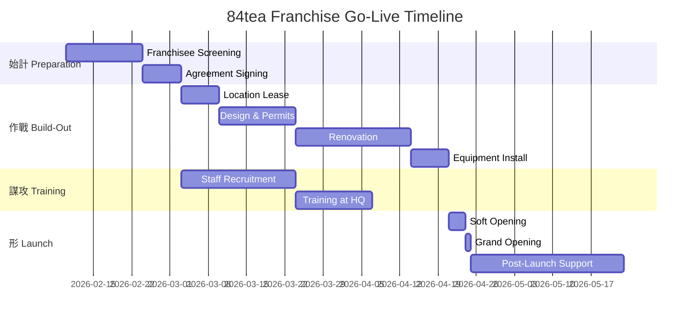

# 🌵 84tea - Franchise Go-Live Strategy

> _"兵貴神速" (Binh quý thần tốc)_
> _Speed is the essence of war - đánh nhanh, thắng nhanh_

---

## 📊 Executive Summary

### Franchise Package: **PHÒNG TRÀ 84tea**

| Parameter                  | Value               | Notes                |
| -------------------------- | ------------------- | -------------------- |
| **Total Investment**       | **300,000,000 VND** | ~$12,000 USD         |
| **Franchise Fee**          | 50,000,000 VND      | 3-year license       |
| **Setup Cost**             | 180,000,000 VND     | Equipment + fit-out  |
| **Working Capital**        | 70,000,000 VND      | 3 months runway      |
| **Monthly Revenue Target** | 80-120M VND         | Based on 50 cups/day |
| **Breakeven**              | 6-8 months          | At 70% efficiency    |
| **ROI**                    | 12-18 months        | 25-40% margin        |

---

## 🗡️ Binh Pháp 13 Thiên - Franchise Mapping

### Thiên 1: 始計 (Shǐ Jì - Laying Plans)

**5 Constants for Franchise Success:**

| Factor         | Franchise Application                                        | Score |
| -------------- | ------------------------------------------------------------ | ----- |
| **道 (Đạo)**   | Brand mission alignment - passion for Vietnamese tea culture | 9/10  |
| **天 (Thiên)** | Market timing - wellness & premium tea trend 2026            | 8/10  |
| **地 (Địa)**   | Location selection criteria - traffic, demographics          | 8/10  |
| **將 (Tướng)** | Franchisee screening - commitment, capital, skills           | 7/10  |
| **法 (Pháp)**  | Operating system - SOPs, training, support                   | 9/10  |

---

### Thiên 2: 作戰 (Zuò Zhàn - Waging War)

**300M VND Investment Breakdown:**

```
┌─────────────────────────────────────────────────────────────┐
│           84tea FRANCHISE INVESTMENT (300M VND)            │
├─────────────────────────────────────────────────────────────┤
│                                                             │
│  🏷️ Franchise Fee (Phí nhượng quyền)        50M  (16.7%)   │
│  ████████████                                               │
│                                                             │
│  🏗️ Fit-out & Renovation                    80M  (26.7%)   │
│  ████████████████████                                       │
│                                                             │
│  ⚙️ Equipment & Fixtures                    60M  (20.0%)   │
│  ███████████████                                            │
│                                                             │
│  📦 Initial Inventory                       40M  (13.3%)   │
│  ██████████                                                 │
│                                                             │
│  💰 Working Capital (3 months)              70M  (23.3%)   │
│  █████████████████                                          │
│                                                             │
└─────────────────────────────────────────────────────────────┘
```

#### Detailed Cost Matrix

| Category            | Item                    | Amount (VND)    | Notes                   |
| ------------------- | ----------------------- | --------------- | ----------------------- |
| **Franchise Fee**   | License (3 years)       | 50,000,000      | Includes brand usage    |
|                     | Training program        | Included        | 2-week intensive        |
|                     | Opening support         | Included        | 2 weeks on-site         |
| **Fit-out**         | Design consultation     | 5,000,000       | Brand-standard design   |
|                     | Renovation/construction | 50,000,000      | 25-40m² space           |
|                     | Signage & branding      | 15,000,000      | Exterior + interior     |
|                     | Furniture               | 10,000,000      | Tables, chairs, display |
| **Equipment**       | Tea brewing station     | 15,000,000      | Professional setup      |
|                     | Refrigeration           | 8,000,000       | Display + storage       |
|                     | POS system              | 7,000,000       | iPad + printer          |
|                     | Water filtration        | 5,000,000       | Premium quality         |
|                     | Teaware collection      | 10,000,000      | Ceramic, glass          |
|                     | Kitchen equipment       | 8,000,000       | Kettle, steamer, etc.   |
|                     | Audio/ambiance          | 7,000,000       | Speakers, lighting      |
| **Inventory**       | Tea products (all SKUs) | 30,000,000      | 2-month stock           |
|                     | Packaging supplies      | 5,000,000       | Boxes, bags, labels     |
|                     | Consumables             | 5,000,000       | Cups, napkins           |
| **Working Capital** | Rent deposit            | 30,000,000      | 2-3 months              |
|                     | Operating reserve       | 20,000,000      | Utilities, misc         |
|                     | Staff salaries          | 20,000,000      | 1.5 months buffer       |
| **TOTAL**           |                         | **300,000,000** |                         |

---

### Thiên 3: 謀攻 (Móu Gōng - Strategic Attack)

**Location Selection Strategy:**

| Tier  | Location Type         | Rent/month | Traffic     | Priority |
| ----- | --------------------- | ---------- | ----------- | -------- |
| **A** | CBD shopping mall     | 25-40M     | High        | ⭐⭐⭐   |
| **B** | Street-front urban    | 15-25M     | Medium-High | ⭐⭐⭐   |
| **C** | Office building lobby | 10-20M     | Medium      | ⭐⭐     |
| **D** | Residential area      | 8-15M      | Medium-Low  | ⭐       |

**Target Demographics:**

| Segment       | Age   | Income       | Behavior                       |
| ------------- | ----- | ------------ | ------------------------------ |
| **Primary**   | 25-45 | 15-50M/month | Health-conscious professionals |
| **Secondary** | 18-25 | 8-15M/month  | Trendy, Instagram-focused      |
| **Tertiary**  | 45+   | 20M+/month   | Traditional tea lovers         |

---

### Thiên 4: 形 (Xíng - Tactical Dispositions)

**Store Format Standards:**

```
┌──────────────────────────────────────────────────────────┐
│                 84tea PHÒNG TRÀ LAYOUT                      │
│                    (25-40 m² minimum)                    │
├──────────────────────────────────────────────────────────┤
│                                                          │
│   ┌─────────────┐     ┌──────────────────────────────┐  │
│   │   ENTRANCE  │     │      SEATING AREA            │  │
│   │   & DISPLAY │     │   • 6-10 seats indoor        │  │
│   └─────────────┘     │   • Tea ceremony corner      │  │
│                       │   • Instagram-worthy décor   │  │
│   ┌─────────────┐     └──────────────────────────────┘  │
│   │  COUNTER    │                                        │
│   │  & BREWING  │     ┌──────────────────────────────┐  │
│   │  STATION    │     │      PRODUCT DISPLAY         │  │
│   └─────────────┘     │   • Hero products            │  │
│                       │   • Gift sets                │  │
│   ┌─────────────┐     │   • Take-home packages       │  │
│   │   STORAGE   │     └──────────────────────────────┘  │
│   │   & BACK    │                                        │
│   └─────────────┘                                        │
│                                                          │
└──────────────────────────────────────────────────────────┘
```

**Design Elements (Mandatory):**

| Element       | Specification                       | Purpose            |
| ------------- | ----------------------------------- | ------------------ |
| Color palette | Imperial Green + Gold Leaf          | Brand consistency  |
| Lighting      | Warm 2700K-3000K                    | Cozy ambiance      |
| Music         | Traditional Vietnamese instrumental | Cultural immersion |
| Scent         | Natural tea aroma                   | Sensory branding   |
| Uniforms      | Áo dài-inspired apron               | Authentic touch    |

---

### Thiên 6: 虛實 (Xū Shí - Weak Points & Strong)

**Competitive Advantages:**

| 84tea                  | vs Bubble Tea Chains | vs Coffee Shops   |
| ---------------------- | -------------------- | ----------------- |
| ✅ Premium positioning | ❌ Mass market       | ❌ Commodity      |
| ✅ Vietnamese heritage | ❌ Generic Asian     | ❌ Western focus  |
| ✅ Health benefits     | ❌ High sugar        | ❌ Caffeine crash |
| ✅ 300M entry          | 400-700M typical     | 500M-1.5B typical |
| ✅ 40% margin          | 20-30% margin        | 15-25% margin     |

---

### Thiên 7: 軍爭 (Jūn Zhēng - Maneuvering)

**Revenue Model:**

| Revenue Stream           | % of Sales | Margin | Notes                |
| ------------------------ | ---------- | ------ | -------------------- |
| **Dine-in tea service**  | 40%        | 60-70% | Core experience      |
| **Take-away drinks**     | 25%        | 55-65% | Convenience          |
| **Retail products**      | 20%        | 40-50% | Gift sets, loose tea |
| **Tea ceremony package** | 10%        | 70-80% | Premium experience   |
| **Corporate/events**     | 5%         | 50-60% | B2B partnerships     |

**Pricing Strategy:**

| Product Category     | Price Range | Avg. Ticket |
| -------------------- | ----------- | ----------- |
| Hot tea (pot)        | 45K-85K     | 65K         |
| Cold tea             | 35K-55K     | 45K         |
| Tea ceremony (2 pax) | 200K-350K   | 275K        |
| Retail - Standard    | 350K-500K   | 425K        |
| Retail - Limited     | 500K-1,200K | 750K        |

---

## 📈 Financial Projections

### P&L Model (Monthly)

| Item             | Best Case | Expected | Conservative |
| ---------------- | --------- | -------- | ------------ |
| **Revenue**      | 120M      | 90M      | 65M          |
| COGS (35%)       | (42M)     | (31.5M)  | (22.75M)     |
| **Gross Profit** | 78M       | 58.5M    | 42.25M       |
| Rent             | (20M)     | (20M)    | (20M)        |
| Staff (2-3 FTE)  | (18M)     | (15M)    | (12M)        |
| Utilities        | (5M)      | (4M)     | (3M)         |
| Marketing        | (5M)      | (3M)     | (2M)         |
| Royalty (5%)     | (6M)      | (4.5M)   | (3.25M)      |
| Misc             | (3M)      | (2M)     | (2M)         |
| **Net Profit**   | **21M**   | **10M**  | **0**        |
| **Margin**       | 17.5%     | 11.1%    | 0%           |

### Break-even Analysis

| Metric                   | Value        | Notes                              |
| ------------------------ | ------------ | ---------------------------------- |
| Fixed costs/month        | ~53M         | Rent + staff + utilities + royalty |
| Avg. contribution margin | 60%          | After COGS                         |
| Break-even revenue       | ~88M/month   | 53M ÷ 60%                          |
| Break-even cups/day      | ~45 cups     | At avg. 65K/cup                    |
| Investment payback       | 12-18 months | At expected scenario               |

---

## 🚀 Go-Live Checklist

### Phase 1: Pre-Signing (Week 1-2)

- [ ] 🔴 Franchisee application form complete
- [ ] 🔴 Financial verification (300M+ available)
- [ ] 🔴 Location scouting (3+ options)
- [ ] 🔴 Franchise disclosure document review
- [ ] 🔴 Franchise agreement signing
- [ ] 🔴 50M franchise fee payment

### Phase 2: Pre-Build (Week 3-4)

- [ ] 🔴 Location lease signed
- [ ] 🔴 Business registration (GPKD)
- [ ] 🔴 Design approval from HQ
- [ ] 🔴 Contractor selection
- [ ] 🔴 Equipment order placed
- [ ] 🟡 Food safety certificate application
- [ ] 🟡 Staff recruitment started

### Phase 3: Build-Out (Week 5-8)

- [ ] 🔴 Renovation begins
- [ ] 🔴 Equipment installation
- [ ] 🔴 Signage installation
- [ ] 🔴 POS system setup
- [ ] 🔴 Inventory delivery
- [ ] 🟡 Staff training (2 weeks at HQ)
- [ ] 🟡 Soft opening preparation

### Phase 4: Launch (Week 9-10)

- [ ] 🔴 Final inspection by HQ
- [ ] 🔴 Staff certification complete
- [ ] 🔴 Inventory stocked
- [ ] 🔴 Soft opening (3 days)
- [ ] 🔴 Grand opening event
- [ ] 🟡 Social media campaign launch
- [ ] 🟡 Google Business Profile setup
- [ ] 🟢 Press release distribution

### Phase 5: Post-Launch Support (Week 11-14)

- [ ] 🔴 Daily sales monitoring
- [ ] 🔴 Customer feedback collection
- [ ] 🔴 Staff performance review
- [ ] 🟡 Menu optimization
- [ ] 🟡 Marketing ROI analysis
- [ ] 🟢 Community partnerships
- [ ] 🟢 Corporate outreach

---

## 📋 Franchise Package Contents

### What Franchisee Receives:

| Component             | Description                              | Value         |
| --------------------- | ---------------------------------------- | ------------- |
| **Brand License**     | Use of 84tea name, logo, materials       | 3 years       |
| **Training Program**  | 2-week intensive at HQ                   | 10M VND value |
| **Operations Manual** | 200+ page SOP document                   | Included      |
| **Recipe Book**       | All beverage formulas                    | Proprietary   |
| **Opening Support**   | 2 weeks on-site team                     | 15M VND value |
| **Marketing Kit**     | Templates, photos, social assets         | 5M VND value  |
| **Supplier Access**   | Direct ordering from certified suppliers | Ongoing       |
| **Tech Stack**        | POS, inventory, CRM setup                | Included      |
| **Ongoing Support**   | WhatsApp group, monthly calls            | Ongoing       |

### Ongoing Fees:

| Fee Type           | Amount        | Frequency     |
| ------------------ | ------------- | ------------- |
| **Royalty**        | 5% of revenue | Monthly       |
| **Marketing Fund** | 2% of revenue | Monthly       |
| **Product Markup** | Cost + 10%    | Per order     |
| **Renewal Fee**    | 25M VND       | Every 3 years |

---

## 🎯 Franchisee Criteria

### Must-Have:

| Requirement     | Standard                        | Verification   |
| --------------- | ------------------------------- | -------------- |
| **Capital**     | 300M+ available                 | Bank statement |
| **Commitment**  | Full-time OR dedicated manager  | Interview      |
| **Location**    | Approved territory              | HQ assessment  |
| **Credit**      | No bankruptcy history           | Credit check   |
| **Culture fit** | Passion for F&B, Vietnamese tea | Assessment     |

### Nice-to-Have:

- F&B experience
- Business ownership experience
- Local community connections
- Marketing skills
- Hospitality background

---

## 📊 KPIs & Reporting

### Franchisee Dashboard Metrics:

| Metric                | Target     | Frequency |
| --------------------- | ---------- | --------- |
| Daily cups sold       | 50+        | Daily     |
| Avg. ticket size      | 65K+       | Daily     |
| Customer satisfaction | 4.5+ stars | Weekly    |
| Repeat customer rate  | 30%+       | Monthly   |
| Inventory turnover    | 15 days    | Monthly   |
| Staff turnover        | <20%/year  | Quarterly |
| Net profit margin     | 10%+       | Monthly   |

### HQ Monitoring:

| Activity           | Purpose             | Frequency |
| ------------------ | ------------------- | --------- |
| POS data sync      | Sales monitoring    | Real-time |
| Mystery shopper    | Quality control     | Monthly   |
| On-site audit      | Compliance check    | Quarterly |
| Franchisee call    | Support & alignment | Monthly   |
| Performance review | Contract compliance | Annual    |

---

## 🗓️ Execution Roadmap



---

## 📎 Appendices

### A. Standard Equipment List

| Equipment               | Specification          | Qty | Unit Price | Total   |
| ----------------------- | ---------------------- | --- | ---------- | ------- |
| Electric kettle station | 3L, temp control       | 2   | 3M         | 6M      |
| Display refrigerator    | 200L, glass door       | 1   | 8M         | 8M      |
| Tea brewing table       | Custom, velvet green   | 1   | 8M         | 8M      |
| POS terminal            | iPad + stand + printer | 1   | 7M         | 7M      |
| Water filter system     | 5-stage RO             | 1   | 5M         | 5M      |
| Ceramic teaware set     | Premium, 10 sets       | 10  | 500K       | 5M      |
| Glass teaware set       | Heat-resistant         | 20  | 200K       | 4M      |
| Audio system            | Bluetooth, 4 speakers  | 1   | 4M         | 4M      |
| Ambient lighting        | LED warm white         | 1   | 3M         | 3M      |
| Storage shelving        | Wood, branded          | 2   | 2M         | 4M      |
| Serving trays           | Bamboo, branded        | 10  | 300K       | 3M      |
| Misc equipment          |                        |     |            | 3M      |
| **TOTAL**               |                        |     |            | **60M** |

### B. Initial Product Order

| SKU        | Product                  | Qty | Unit Cost | Total    |
| ---------- | ------------------------ | --- | --------- | -------- |
| TRA-SHAN-6 | Shan Tuyết 6g LIMITED    | 50  | 300K      | 15M      |
| TRA-LUC-80 | Lục Trà 80g              | 30  | 210K      | 6.3M     |
| TRA-CO-80  | Trà Cổ Thụ 80g           | 25  | 390K      | 9.75M    |
| TRA-BANH   | Men Sống Bánh            | 10  | 480K      | 4.8M     |
|            | Packaging supplies       |     |           | 5M       |
|            | Consumables (cups, etc.) |     |           | 5M       |
| **TOTAL**  |                          |     |           | **~40M** |

### C. Staff Structure

| Position       | Qty | Salary/month | Total    |
| -------------- | --- | ------------ | -------- |
| Store Manager  | 1   | 10-12M       | 11M      |
| Tea Specialist | 1   | 7-9M         | 8M       |
| Service Staff  | 1-2 | 5-6M each    | 5.5M     |
| **TOTAL**      | 3-4 |              | **~25M** |

---

## ✅ User Review Required

> [!IMPORTANT]
>
> ### Critical Decisions for Client:
>
> 1. **Franchise Fee Structure**: 50M for 3 years - confirm acceptable?
> 2. **Royalty Rate**: 5% monthly - market standard, confirm?
> 3. **Minimum Store Size**: 25m² - sufficient for experience?
> 4. **Territory Protection**: Radius exclusivity (1-3km)?
> 5. **Training Location**: HQ in Hanoi - or regional options?
> 6. **First Pilot Location**: City preference for flagship store?

> [!CAUTION]
>
> ### Legal Requirements:
>
> - Franchise registration with Ministry of Industry and Trade (MOIT)
> - Franchise Disclosure Document (FDD) preparation
> - Trademark registration completion
> - Standard franchise agreement legal review

---

_Strategic Plan by AgencyOS × Binh Pháp Framework_
_Date: 2026-02-05 | Version: 1.0_
_Model: 84tea Phòng Trà Franchise_
