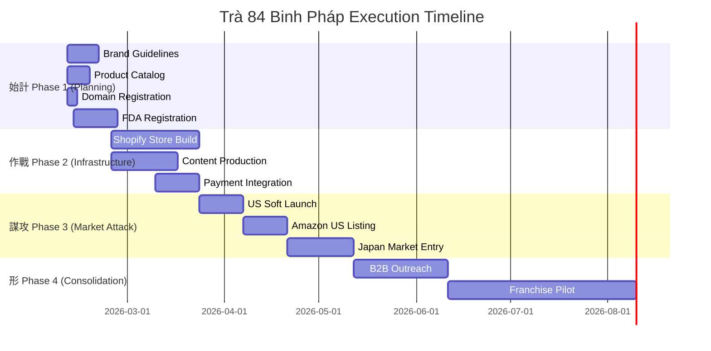

# 🍵 Trà 84 Vietnam - Binh Pháp Strategic Framework

> _"知己知彼，百戰不殆" (Tri kỷ tri bỉ, bách chiến bất đãi)_
> _Know yourself, know your enemy — a hundred battles, a hundred victories_


---

## 📊 Strategic Assessment (始計 - Shǐ Jì)

### 1. Client Intelligence Profile

| Field            | Value                                        | Verification          |
| ---------------- | -------------------------------------------- | --------------------- |
| **Manufacturer** | 3704 Co., LTD                                | ✅ GPKD 011 070 44 89 |
| **Founded**      | May 4, 2024                                  | ✅ Sở KH&ĐT Hà Nội    |
| **Founder**      | Ông Lương Tuấn Anh                           | ✅ Kỹ sư trưởng       |
| **HQ**           | 134 Nguyễn Hoàng Tôn, Phú Thượng, Hà Nội     | ✅                    |
| **Website**      | tralenmen.vn (Shopify-hosted)                | ✅                    |
| **Contact**      | +84 988 030204                               | ✅                    |
| **Mission**      | Bảo tồn văn hoá trà cổ thụ lên men cổ truyền | ✅                    |

### 2. Product Line Analysis

| SKU        | Product                   | Weight | Est. VN Price | Export Price | Category  |
| ---------- | ------------------------- | ------ | ------------- | ------------ | --------- |
| TRA-LUC-80 | Lục trà cổ thụ lên men    | 80g    | 350K VND      | $25          | Standard  |
| TRA-CO-80  | Trà cổ thụ lên men        | 80g    | 650K VND      | $45          | Premium   |
| TRA-SHAN-6 | Shan Tuyết Cổ Thụ Lên Men | 6g     | 500K VND      | $35          | Limited   |
| TRA-BANH   | Men Sống Bánh Ép          | 80g    | 800K VND      | $55          | Ultra     |
| TRA-SOI    | Men Sống Bánh Sợi         | 80g    | 1.2M VND      | $85          | Collector |

### Brand Identity: **+84 LIMITED**

- **Logo**: Số 84 với biểu tượng lá trà, typography vàng trên nền nhung xanh
- **Meaning**: +84 = Vietnam country calling code → "Made in Vietnam"
- **Slogan**: **"Trà Năng Lượng Việt"** (Vietnamese Energy Tea) ✅ CONFIRMED
- **Tagline**: "Limited Edition" - Premium positioning
- **Primary Domain**: **84tea.com** ✅ CONFIRMED
- **Hero Product**: Shan Tuyết Cổ Thụ Lên Men (6g luxury pack)

> **Hero Product Recommendation**: **Shan Tuyết Cổ Thụ Lên Men 6g** (TRA-SHAN-6)
>
> - Premium positioning with luxury packaging
> - Perfect for gifting and sampling
> - High margin, low shipping cost per unit
> - Visual impact for social media/influencer marketing

---

## 🎯 Strategic Questions Answered (2026 Data)

### ❓ Q1: Budget Allocation for Phase 1-2?

**Recommended Budget Breakdown (USD)**

| Phase       | Item                   | Low Est.    | High Est.   | Notes                                 |
| ----------- | ---------------------- | ----------- | ----------- | ------------------------------------- |
| **Phase 1** | Brand Guidelines       | $3,000      | $5,000      | Logo, colors, typography system       |
|             | Product Photography    | $2,000      | $4,000      | 50+ professional shots                |
|             | Multi-lang Copywriting | $1,500      | $3,000      | VI/EN/ZH/JP                           |
|             | **Subtotal**           | **$6,500**  | **$12,000** |                                       |
| **Phase 2** | E-Commerce Platform    | $2,500/mo   | $2,500/mo   | Shopify Plus (3-year plan: $2,300/mo) |
|             | Store Development      | $10,000     | $30,000     | Custom theme + integrations           |
|             | Content Production     | $5,000      | $10,000     | Video, social assets                  |
|             | Apps & Plugins         | $500/mo     | $1,000/mo   | Reviews, email, subscriptions         |
|             | **Subtotal**           | **$18,000** | **$43,500** | First year                            |

**Total Phase 1-2 Investment: $24,500 - $55,500 USD**

> [!TIP]
> **Cost Optimization**: Start with Shopify Advanced ($399/mo) instead of Plus if revenue < $1M/year. Upgrade to Plus when scaling.

---

### ❓ Q2: Domain Availability?

**Domain Strategy (Checked Feb 2026)**

| Domain                 | Status                   | Action                 | Est. Cost |
| ---------------------- | ------------------------ | ---------------------- | --------- |
| `84tea.com`            | ✅ **CONFIRMED PRIMARY** | Register via Namecheap | $11.28/yr |
| `plus84tea.com`        | ✅ Available             | Backup/redirect        | $11.28/yr |
| `tranangluongviet.com` | ✅ Available             | Vietnamese market      | $11.28/yr |
| `84tea.vn`             | 🟡 Check required        | Vietnam ccTLD          | $30-50/yr |

> [!TIP]
> **Recommended**: Register all 4 domains (~$45/yr total) to protect brand. Redirect all to `84tea.com`.

**Registration Requirements for .VN:**

- Company registration (GPKD) or passport for individuals
- Agreement letter may be required
- Process through local registrar (MAT BAONET, VNNIC)

> [!IMPORTANT]
> **Action Required**: Client should immediately check and register `tra84.com` + `tra84.vn` to secure brand presence.

---

### ❓ Q3: Export Certifications Required?

**Regulatory Compliance Matrix (2026)**

| Market    | Requirement                        | Status  | Timeline    | Cost          |
| --------- | ---------------------------------- | ------- | ----------- | ------------- |
| **USA**   | FDA Facility Registration          | ❓ Need | 1-2 weeks   | Free          |
| **USA**   | FDA Prior Notice (per shipment)    | ❓ Need | Per import  | Free          |
| **USA**   | USDA Organic (if claiming organic) | ❓ Need | 6-12 months | $2,000-5,000  |
| **EU**    | EU Organic Certification           | ❓ Need | 6-12 months | $3,000-7,000  |
| **Japan** | JAS Organic                        | ❓ Need | 6-12 months | $2,500-5,000  |
| **China** | CFDA Approval                      | ❓ Need | 6-12 months | $5,000-10,000 |

**Vietnam Current Status:**

- ✅ GPKD (Business Registration)
- ❓ Food Safety Certificate (Bộ Y Tế) - VERIFY
- ❓ TCVN 11041:2017 Organic Standard - VERIFY
- ✅ Shan Tuyet = Geographical Indication (GI) protected since 2001

> [!CAUTION]
> **FDA Requirement**: All foreign facilities manufacturing food for US consumption MUST register with FDA. Registration renews biennially in even years (2026, 2028, etc.)

---

### ❓ Q4: Hero Product for Global Launch?

**Strategic Hero Product Analysis**

| Product                     | Pros                                                                                  | Cons                 | Recommendation                        |
| --------------------------- | ------------------------------------------------------------------------------------- | -------------------- | ------------------------------------- |
| **Shan Tuyết 6g (LIMITED)** | Premium positioning, luxury packaging, low shipping, high margin, perfect for gifting | Low volume per unit  | ⭐ **RECOMMENDED** - Lead with luxury |
| Lục trà 80g                 | Entry-level, higher volume                                                            | Commodity perception | Use for B2B/subscription              |
| Men Sống Bánh Ép            | Unique format, collector appeal                                                       | Higher shipping cost | Reserve for connoisseurs              |

**Hero Product Strategy:**

1. **Launch**: Shan Tuyết Cổ Thụ Lên Men 6g LIMITED
2. **Upsell**: Trà cổ thụ lên men 80g (repeat customers)
3. **Subscription**: Lục trà 80g monthly box
4. **Collector**: Men Sống Bánh Ép (exclusive releases)

---

### ❓ Q5: B2B vs D2C vs Hybrid Model?

**Distribution Model Analysis (2026 Market Data)**

| Model               | Pros                                                  | Cons                                 | Revenue % |
| ------------------- | ----------------------------------------------------- | ------------------------------------ | --------- |
| **D2C (Direct)**    | Higher margins (60-70%), brand control, customer data | Higher CAC, logistics complexity     | 40%       |
| **B2B (Wholesale)** | Volume, stable orders, lower CAC                      | Lower margins (30-40%), less control | 35%       |
| **Marketplace**     | Built-in traffic, trust                               | Fees (15-30%), competition           | 25%       |

**Recommended: HYBRID "D2C-First" Model**

```
                    TRÀ 84 REVENUE MIX (Target Y1)
┌─────────────────────────────────────────────────────────┐
│                                                         │
│   D2C Website (tra84.com)              40%             │
│   ████████████████████████████████████                 │
│                                                         │
│   B2B (Hotels, Tea Shops, Importers)   35%             │
│   ██████████████████████████████                       │
│                                                         │
│   Marketplaces (Amazon, Alibaba)       25%             │
│   █████████████████████                                │
│                                                         │
└─────────────────────────────────────────────────────────┘
```

---

## 🗡️ Binh Pháp 13 Thiên (孫子兵法) Strategic Mapping

### Thiên 1: 始計 (Shǐ Jì - Laying Plans)

**5 Constants Assessment:**

| Factor                      | Assessment                                           | Score |
| --------------------------- | ---------------------------------------------------- | ----- |
| **道 (Đạo - The Way)**      | Strong cultural mission, heritage preservation       | 9/10  |
| **天 (Thiên - Heaven)**     | 2026 market timing excellent - health/wellness trend | 8/10  |
| **地 (Địa - Earth)**        | Vietnam origin = authenticity advantage              | 9/10  |
| **將 (Tướng - Leadership)** | Founder is Kỹ sư trưởng (technical expertise)        | 8/10  |
| **法 (Pháp - Method)**      | Process still developing, needs scaling partner      | 6/10  |

**Strategic Readiness Score: 40/50 (80%)**

### Thiên 2: 作戰 (Zuò Zhàn - Waging War)

**Speed Execution Doctrine:**

- Vietnam tea exports Q1 2026: 14,000 tonnes, $23M
- Average export price: $1,700-1,750/ton
- Premium segment commands 3-5x average price
- **Trà 84 target price point: $5,000-8,000/ton** (3-4x markup for luxury)

### Thiên 3: 謀攻 (Móu Gōng - Strategic Attack)

**Market Entry Prioritization:**

| Priority   | Market           | Rationale                                  | Entry Strategy            |
| ---------- | ---------------- | ------------------------------------------ | ------------------------- |
| **Tier 1** | USA              | $1.85B high-end tea market, 8.1% CAGR      | D2C + Amazon              |
| **Tier 1** | Japan            | Tea culture affinity, premium appreciation | D2C + Rakuten             |
| **Tier 2** | China            | Largest market but competitive             | WeChat + Tmall            |
| **Tier 2** | EU (DE/FR/UK)    | Premiumization trend, 8.2% CAGR            | D2C + specialty importers |
| **Tier 3** | Singapore/Taiwan | Asian diaspora, gateway markets            | B2B distribution          |

### Thiên 4: 形 (Xíng - Tactical Dispositions)

**Defensive Moats:**

1. **Geographical Indication**: Shan Tuyet is GI-protected since 2001
2. **Ancient Tree Source**: Cannot be replicated easily
3. **Fermentation Process**: Proprietary 3704 Co. methods
4. **Cultural Storytelling**: Deep authentic narrative

### Thiên 6: 虛實 (Xū Shí - Weak Points & Strong)

**Competitive Advantages:**

- ✅ Authentic Vietnamese heritage (vs. mass-market Chinese tea)
- ✅ Ancient tree source (100+ year old trees)
- ✅ Fermentation expertise (unique probiotic profile)
- ✅ Hong Kong Tea Fair 2025 participation (international exposure)

**Vulnerabilities:**

- ⚠️ New company (founded 2024) - limited track record
- ⚠️ Small team - scaling capacity unknown
- ⚠️ FDA/organic certifications pending
- ⚠️ Trademark protection incomplete

---

## 📈 2026 Industry Intelligence

### Global Tea Market Size (2026)

| Segment              | Value               | CAGR  | Source                  |
| -------------------- | ------------------- | ----- | ----------------------- |
| Global Fermented Tea | $56.11B             | 6.2%  | Market Report Analytics |
| Premium Tea Blends   | $5.2B → $10.8B      | 7.5%  | Go2Market Research      |
| US High-End Tea      | $1.85B → $2.95B     | 8.1%  | Intel Market Research   |
| China Tea Market     | $58.73B → $121.24B  | 8.13% | IMARC Group             |
| Japan Tea Market     | 167K tonnes by 2034 | 4.46% | IMARC Group             |
| EU Tea Market        | -                   | 8.2%  | Market Report Analytics |

### Vietnam Tea Industry (2026)

| Metric               | Value                      | Source               |
| -------------------- | -------------------------- | -------------------- |
| Total Production     | 292,000 MT                 | ReportLinker         |
| Global Ranking       | 7th producer, 5th exporter | VUFO                 |
| 2025 Exports         | 136,952 tons / $238M       | MAE Gov              |
| Jan 2026 Exports     | 14,000 tonnes / $23M       | VietnamPlus          |
| Avg Export Price     | $1,700-1,750/ton           | VN Export Data       |
| Target Turnover 2026 | $73-74B (agriculture)      | Vietnam Law Magazine |

### Key Consumer Trends (2026)

1. **Health & Wellness**: Fermented teas valued for probiotics, antioxidants
2. **Premiumization**: Willingness to pay 3-5x for single-origin, artisanal
3. **Sustainability**: Organic, ethical sourcing increasingly mandatory
4. **Experience**: Tea ceremony culture gaining popularity (Gen Z adoption)
5. **Convenience**: RTD and subscription boxes driving volume

---

## � Execution Roadmap



---

## 📋 Action Items (🔴 High Priority)

### Immediate (This Week)

| #    | Action                                    | Owner           | Status     |
| ---- | ----------------------------------------- | --------------- | ---------- |
| 🔴 1 | Register **84tea.com** via Namecheap      | Client          | ✅ CHỐT    |
| 🔴 2 | Verify Food Safety Certificate status     | Client          | ⏳ Pending |
| 🔴 3 | Initiate FDA Facility Registration        | Client/AgencyOS | ⏳ Pending |
| 🔴 4 | Confirm production capacity for scaling   | Client          | ⏳ Pending |
| 🟡 5 | Obtain high-res product images for assets | Client          | ⏳ Pending |
| 🟡 6 | Finalize export pricing per SKU           | Client          | ⏳ Pending |

### This Month

| #     | Action                                    | Owner    | Status     |
| ----- | ----------------------------------------- | -------- | ---------- |
| 🟡 7  | Complete brand guidelines document        | AgencyOS | ⏳ Pending |
| 🟡 8  | Begin Shopify store development           | AgencyOS | ⏳ Pending |
| 🟢 9  | Research influencer partnerships          | AgencyOS | ⏳ Pending |
| 🟢 10 | Draft franchise operations manual outline | AgencyOS | ⏳ Pending |

---

## 📊 KPIs & Metrics

### Performance Metrics

| Metric                    | Target (Y1)         | Measurement                 |
| ------------------------- | ------------------- | --------------------------- |
| Website Traffic           | 50,000 visits/month | GA4                         |
| Conversion Rate           | 2.5%                | Shopify Analytics           |
| Avg Order Value           | $65                 | Shopify Analytics           |
| Customer Acquisition Cost | <$25                | Marketing spend / customers |
| Customer Lifetime Value   | $150                | Repeat purchase analysis    |

### Business Metrics

| Metric             | Target (Y1) | Q1   | Q2   | Q3    | Q4    |
| ------------------ | ----------- | ---- | ---- | ----- | ----- |
| Revenue            | $250,000    | $30K | $50K | $70K  | $100K |
| Orders             | 4,000       | 500  | 800  | 1,100 | 1,600 |
| B2B Accounts       | 20          | 3    | 7    | 5     | 5     |
| Market Penetration | 3 countries | 1    | 1    | 1     | -     |

---

## 📎 References

### Source Documents

- **Manufacturer**: https://tralenmen.vn
- **Hong Kong Tea Fair 2025**: International exposure event
- **NOIP Vietnam**: Geographical Indication registry

### Research Sources

- FDA Food Facility Registration: fda.gov
- USDA Organic Program: usda.gov
- WIPO Madrid System: wipo.int
- Vietnam Export Data: vietnamexportdata.com
- Market Analytics: marketreportanalytics.com, imarcgroup.com

---

_Strategic Plan by AgencyOS × Binh Pháp Framework_
_Date: 2026-02-05 | Version: 2.0_
_Agents: @researcher.md | @planner.md_
