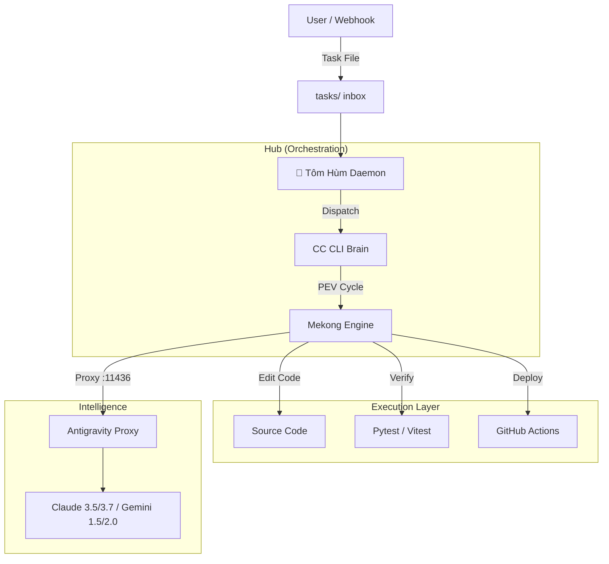

# 🌊 Mekong CLI — RaaS Agency Operating System

<div align="center">


**The Revenue-as-a-Service (RaaS) Foundation for Autonomous AI Agencies.**
Powered by **ClaudeKit DNA** & **Sun Tzu's Art of War (孫子兵法)**.

[🚀 Quick Start](#-quick-start) • [📦 Architecture](#-architecture) • [💎 Tiers](#-raas-foundation-tiers) • [🎯 Features](#-features) • [🤝 Contributing](#-contributing) • [🇻🇳 Tiếng Việt](README.vi.md)

</div>

---

## 📖 Introduction

**Mekong CLI** is the central nervous system of a **Revenue-as-a-Service (RaaS)** agency. It transforms traditional service models into autonomous outcome-based engines.

Instead of manual labor, Mekong CLI orchestrates "armies" of specialized AI agents to plan, execute, and verify complex engineering and business tasks. Built on the principles of **Sun Tzu's Art of War**, it focuses on strategic victory through precision, speed, and invincibility.

## 🎯 Key Features

### 🧠 **Autonomous Execution Engine (PEV)**
The core **Plan-Execute-Verify** workflow ensures every task is handled systematically:
- **Plan**: Multi-step decomposition using specialized reasoning models (Claude Opus/Sonnet).
- **Execute**: Multi-mode execution (Shell, API, LLM) with autonomous self-healing capabilities.
- **Verify**: Rigorous quality gates (Binh Phap) that enforce zero technical debt, 100% type safety, and military-grade security.

### 🦞 **Tôm Hùm (OpenClaw Daemon)**
The "General" of your AI swarm, maintaining 24/7 autonomous operations:
- **Autonomous Dispatch**: Watches for missions and routes them to the most suitable agents across different sub-projects.
- **Auto-CTO Pilot**: Proactively improves codebase quality, cleans console logs, and audits accessibility when the queue is idle.
- **Thermal & Resource Guard**: Specialized management for M1/M2/M3 chips to ensure long-running autonomous stability.

### ⚡ **Antigravity Proxy**
A high-performance LLM gateway (`port 11436`) providing:
- **Unified API**: Anthropic-compatible interface for any model (Ollama, OpenRouter, Google AI).
- **Intelligent Load Balancing**: Distributed requests across accounts to bypass rate limits.
- **Failover Autonomy**: Seamlessly switches models during quota exhaustion without stopping the mission.

---

## 📦 Architecture

Mekong CLI utilizes a **Hub-and-Spoke** architecture to ensure modularity and scalability:



---

## 💎 RaaS Foundation Tiers

| Feature | **Community (Free)** | **Enterprise (Paid)** |
|---------|---------------------------|----------------------------|
| **Execution Engine** | Local Edge Execution | High-Performance Cloud GPU |
| **Model Access** | Basic Models (Flash/Haiku) | Premium (Opus 4.5/4.6, DeepSeek R1) |
| **Agent Swarm** | Sequential execution | Massive Parallel Agent Teams |
| **Verification** | Basic Quality Gates | 100% Automated Green Production |
| **Custom Skills** | Public Skills Registry | Private Agency Skills (CRM, Ads) |

---

## 🚀 Quick Start

### Prerequisites
- **Python**: 3.11+
- **Node.js**: 20+
- **pnpm**: 8+

### Installation

```bash
# Clone the repository
git clone https://github.com/longtho638-jpg/mekong-cli.git
cd mekong-cli

# Install dependencies
pnpm install
pip install -r requirements.txt

# Configure environment
cp .env.example .env
# Edit .env with your API keys and Proxy settings
```

### Starting the Machine

```bash
# Launch the Tôm Hùm Daemon
cd apps/openclaw-worker
npm run start
```

### Basic Commands

```bash
# Implement a feature with full PEV cycle
mekong cook "Add OAuth2 authentication to the gateway"

# Strategic planning only
mekong plan "Draft architecture for the decentralized RaaS hub"

# Verify system health
mekong run verify-system
```

---

## 🤝 Contributing

We welcome contributions from RaaS architects and AI engineers. Please read our **[CONTRIBUTING.md](./CONTRIBUTING.md)** and **[Binh Phap Standards](./docs/code-standards.md)** before submitting a Pull Request.

---

<div align="center">

**Mekong CLI** © 2026 Binh Phap Venture Studio.
*"In war, let your great object be victory, not lengthy campaigns."*

</div>
