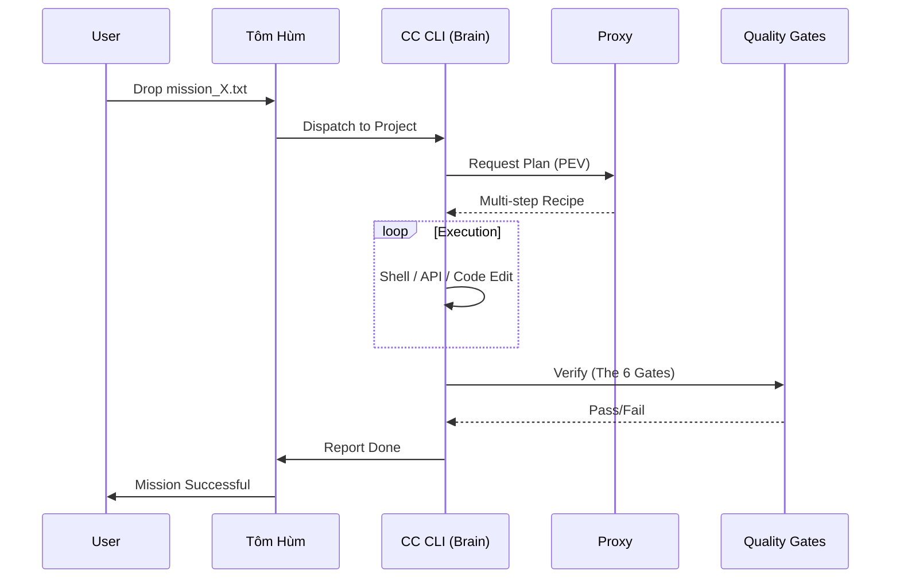
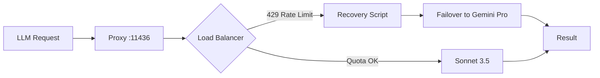

# Mekong CLI: Documentation & DX Strategy Draft

## 1. World-Class README.md Structure
The new README should be highly visual, authoritative, and split between technical excellence and business value.

### Structure:
1.  **Hero Section**:
    - Title: `🌊 Mekong CLI: The RaaS Agency Operating System`
    - Badges (Version, Build Status, Binh Phap Tier, License).
    - One-sentence pitch: "Transforming high-level business goals into verified production code via autonomous Binh Phap orchestration."
2.  **Introduction**:
    - The "Why": Moving from selling hours to selling outcomes (RaaS).
    - The Philosophy: Art of War (孫子兵法) applied to software engineering.
3.  **Core Components (The Triumvirate)**:
    - **🦞 Tôm Hùm (The General)**: Autonomous dispatch & Auto-CTO daemon.
    - **⚙️ Mekong Engine (The Strategy)**: Plan-Execute-Verify (PEV) lifecycle.
    - **⚡ Antigravity Proxy (The Intelligence)**: Port 11436 LLM load-balancer & failover.
4.  **🎯 Key Features**:
    - **Plan-Execute-Verify (PEV)**: Systematic task handling with self-healing.
    - **The 6 Quality Gates**: Hard enforcement of type safety, security, and tech debt.
    - **Autonomous Auto-CTO**: Idle-time optimization of the codebase.
    - **M1 Hardware Awareness**: Thermal & RAM protection for local edge nodes.
5.  **🚀 Quick Start**:
    - Unified installer command (or 3-step pnpm/pip process).
    - "First Mission" guide: Creating a `.txt` mission and watching it execute.
6.  **📦 Architecture**:
    - High-level Mermaid diagram showing the Hub-and-Spoke model.
7.  **💎 RaaS Foundation**:
    - Introduction to the commercial layer and Antigravity Proxy monetization.
8.  **🇻🇳 Multi-Language**:
    - Deep link to `README.vi.md`.

---

## 2. CONTRIBUTING.md Draft
Focus on "Joining the Legion" and adhering to the "Constitution."

### Key Sections:
-   **The Binh Phap Standard**: Every PR must pass the 6 Quality Gates.
-   **Monorepo Workflow**: How to use `pnpm` and `turbo` across the `apps/` and `packages/` dirs.
-   **Mission-Driven Development**: We prefer contributions that solve issues tracked in the `plans/` directory.
-   **Commit Conventions**: Strict adherence to Conventional Commits with a Binh Phap twist (e.g., `feat: [gate-1] - description`).
-   **Testing Protocol**: Mandatory `mekong cook "verify system status"` before submission.

---

## 3. RaaS Foundation & Monetization Outline
This section bridges the gap between the open-source CLI and the commercial RaaS agency model.

### Tiers of Intelligence:
1.  **Community (Open-Core)**:
    - Local execution.
    - User-provided API keys or local Ollama.
    - Standard Binh Phap gates.
2.  **Agency (RaaS Layer - Paid)**:
    - Access to the **Managed Antigravity Proxy**.
    - **Token Optimization**: Automatic routing to cheaper models for simple tasks.
    - **High-Throughput Failover**: Priority access to Opus 4.5/Gemini Pro.
    - **Specialized Skills**: Access to private skill-seekers databases.
3.  **Enterprise (Private Swarm)**:
    - Dedicated orchestrator nodes.
    - Custom security policies and private knowledge vaults.
    - White-label deployment for end-clients.

### The Antigravity Proxy Business Logic:
- **Billing by Outcome**: Instead of charging for tokens, the proxy allows charging by "Mission Success."
- **Efficiency Margin**: The difference between the user's flat fee and the proxy's optimized routing (using smaller models where possible) becomes the agency's profit.

---

## 4. Key Architectural Diagrams (Mermaid)

### Mission Lifecycle (PEV)

### Antigravity Proxy Failover logic

