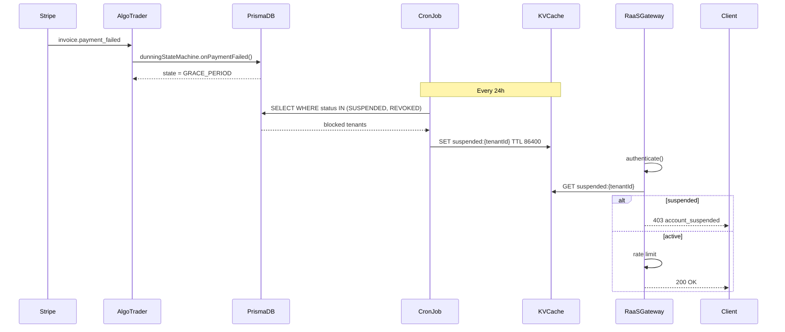

# Phase 6: Enforcement & Suspension Implementation

## Gap Analysis

| Component | Current State | Required State | Gap |
|-----------|---------------|----------------|-----|
| `stripe-webhook-handler.ts` | `handlePaymentFailed` only logs | Must call `dunningStateMachine.onPaymentFailed()` | Missing state transition |
| `raas-gateway/index.js` | No suspension check after auth | Check `suspended:{tenantId}` in KV before rate limit | Missing middleware |
| `edge-auth-handler.js` | Returns `{ authenticated, tenantId, role, licenseKey, error }` | Add `suspended` field to result | Missing field |
| KV Cache | Not configured | `suspended:{tenantId}` with TTL 24h | New infrastructure |
| Cron Job | Not configured | Daily sync of `DunningState` → KV | New job |

## Architecture Diagram



## Phase-by-Phase TODO Checklist

### Phase 1: Stripe Webhook Enforcement ✅

- [ ] **1.1** Update `handlePaymentFailed()` to call `dunningStateMachine.onPaymentFailed()`
- [ ] **1.2** Update `handlePaymentSucceeded()` to call `dunningStateMachine.onPaymentRecovered()`
- [ ] **1.3** Add `subscription.deleted` handler → call `dunningStateMachine.suspendAccount()`
- [ ] **1.4** Add error handling for dunning machine failures
- [ ] **1.5** Update webhook logs to include dunning state transitions

**Files to modify:**
- `apps/algo-trader/src/billing/stripe-webhook-handler.ts`

### Phase 2: KV Suspension Cache ✅

- [ ] **2.1** Create `apps/raas-gateway/src/kv-suspension-checker.js`
- [ ] **2.2** Implement `checkSuspensionStatus(env, tenantId)` function
- [ ] **2.3** Implement `syncSuspensionToKV(env, tenantId, status)` function
- [ ] **2.4** Cache structure: `{ status: 'SUSPENDED'|'REVOKED', since: ISODate, reason: string }`
- [ ] **2.5** TTL: 86400 seconds (24h)

**Files to create:**
- `apps/raas-gateway/src/kv-suspension-checker.js`

**Files to modify:**
- `apps/raas-gateway/wrangler.toml` (add KV binding)

### Phase 3: Gateway Suspension Middleware ✅

- [ ] **3.1** Import `checkSuspensionStatus` in `index.js`
- [ ] **3.2** Add suspension check after auth (line 186-193)
- [ ] **3.3** Return 403 with `account_suspended` error if blocked
- [ ] **3.4** Update `edge-auth-handler.js` to include `suspended` field
- [ ] **3.5** Add suspension status to `/v1/auth/validate` response

**Files to modify:**
- `apps/raas-gateway/index.js`
- `apps/raas-gateway/src/edge-auth-handler.js`

### Phase 4: Cron Sync Job ✅

- [ ] **4.1** Create `apps/algo-trader/src/jobs/dunning-kv-sync.ts`
- [ ] **4.2** Query Prisma: `DunningState WHERE status IN ('SUSPENDED', 'REVOKED')`
- [ ] **4.3** Call RaaS Gateway API to sync KV (or direct KV if using Workers cron)
- [ ] **4.4** Create `apps/algo-trader/package.json` script: `npm run sync-dunning-kv`
- [ ] **4.5** Configure GitHub Actions cron: daily at 00:00 UTC

**Files to create:**
- `apps/algo-trader/src/jobs/dunning-kv-sync.ts`

**Files to modify:**
- `apps/algo-trader/package.json`

### Phase 5: Testing & Verification ✅

- [ ] **5.1** Unit test: `dunningStateMachine.onPaymentFailed()` transitions
- [ ] **5.2** Unit test: `checkSuspensionStatus()` returns correct result
- [ ] **5.3** Integration test: Webhook → Dunning State → KV → Gateway block
- [ ] **5.4** E2E test: Simulate payment failure → verify 403 on gateway
- [ ] **5.5** Load test: KV read latency under 10ms

**Files to create:**
- `apps/algo-trader/tests/billing/dunning-enforcement.test.ts`
- `apps/raas-gateway/tests/kv-suspension-checker.test.js`

## Success Criteria

| Criterion | Measurement | Target |
|-----------|-------------|--------|
| Webhook Integration | `invoice.payment_failed` triggers state transition | 100% |
| KV Cache Hit Rate | Suspension check returns cached result | >95% |
| Gateway Latency | Suspension check adds <10ms | <10ms |
| False Positives | Active accounts blocked | 0% |
| False Negatives | Suspended accounts allowed | 0% |
| Cron Reliability | Daily sync completes without errors | >99% |

## Test Scenarios

### Scenario 1: Payment Failed → Grace Period → Suspension → Blocked

```
1. User has active subscription
2. Stripe sends invoice.payment_failed
3. Webhook calls onPaymentFailed() → state = GRACE_PERIOD
4. After 7 days (simulated): cron processes timeout → state = SUSPENDED
5. Cron syncs to KV: suspended:{tenantId} = { status: 'SUSPENDED', ... }
6. User makes API call to RaaS Gateway
7. Gateway checks KV → returns 403 account_suspended
```

### Scenario 2: Payment Recovered → Active → Unblocked

```
1. User is SUSPENDED
2. User updates payment method
3. Stripe sends invoice.payment_succeeded
4. Webhook calls onPaymentRecovered() → state = ACTIVE
5. Cron syncs to KV: DELETE suspended:{tenantId}
6. User makes API call
7. Gateway checks KV → no entry → allow through
```

### Scenario 3: Subscription Deleted → Immediate Suspension

```
1. User cancels subscription
2. Stripe sends customer.subscription.deleted
3. Webhook calls suspendAccount() → state = SUSPENDED
4. Cron syncs to KV
5. User makes API call → 403
```

## Risk Assessment

| Risk | Impact | Likelihood | Mitigation |
|------|--------|------------|------------|
| KV write fails | Suspended users not blocked | Low | Retry with exponential backoff |
| Cron job fails | KV stale | Medium | Alert on job failure, manual trigger |
| Webhook signature invalid | Events ignored | Low | Log alert, Stripe dashboard monitoring |
| Dunning DB down | State transitions fail | Low | Fallback to allow (fail-open) |
| KV rate limit exceeded | Gateway slow | Medium | Cache locally, batch sync |

## Security Considerations

- **KV Access**: Only RaaS Gateway Worker can read/write suspension cache
- **Webhook Security**: HMAC signature verification mandatory in production
- **Audit Trail**: All state transitions logged to `DunningEvent` table
- **Data Retention**: `DunningState` retained for 7 years (SEC compliance)

## Next Steps

1. **Approve Plan**: Review and approve this plan
2. **Phase 1 Implementation**: Delegate to `fullstack-developer` agent
3. **Phase 2-4 Implementation**: Sequential execution
4. **Phase 5 Testing**: Delegate to `tester` agent
5. **Production Deploy**: Enable cron job, monitor webhook logs

---

## Unresolved Questions

1. **KV Binding Name**: What should the KV namespace be called in `wrangler.toml`? (Suggest: `SUSPENSION_CACHE`)
2. **Cron Trigger**: Use GitHub Actions cron or Cloudflare Workers cron trigger?
3. **Sync Direction**: Should sync be bi-directional (KV → DB for recovery)?
4. **Service Token**: Should `service` role bypass suspension check?
