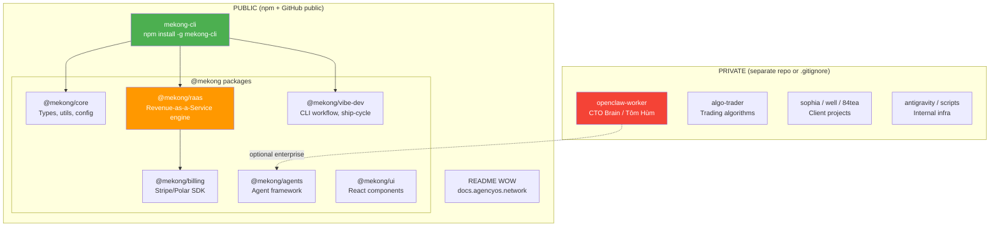

# Phase 0: RaaS Unification — PUBLIC vs PRIVATE Separation

**Ưu tiên:** P0 SUPREME (thay đổi toàn bộ chiến lược restructure)
**Chairman Decree:** "Repo mekong-cli sẽ PUBLIC cho dev dùng nên phải WOW"

## Tầm Nhìn

```
mekong-cli = PUBLIC npm package ecosystem cho developers
├── CLI tool: `npx mekong cook "build my app"`
├── SDK packages: @mekong/core, @mekong/raas, @mekong/vibe-dev
└── RaaS engine: Revenue-as-a-Service (SẢN PHẨM BÁN TIỀN)

Internal = PRIVATE (không publish, không show)
├── CTO Brain (openclaw-worker, Tôm Hùm)
├── Trading (algo-trader)
├── Client projects (sophia, well, 84tea, apex-os...)
└── Infra (antigravity, scripts, monitoring)
```

## Kiến Trúc Thống Nhất



## Phân Loại Chi Tiết

### PUBLIC — Publish lên npm

| Package | Nguồn hiện tại | Mô tả | Dev dùng được? |
|---------|----------------|-------|----------------|
| `mekong-cli` | `src/` (Python) | CLI entry point | ✅ Core product |
| `@mekong/core` | `packages/core/` | Shared types, utils | ✅ Base SDK |
| `@mekong/raas` | `src/raas/` + `packages/billing/` | Revenue engine | ✅ **SẢN PHẨM BÁN TIỀN** |
| `@mekong/vibe-dev` | `packages/vibe-dev/` | Dev workflow tools | ✅ DX tool |
| `@mekong/agents` | `packages/agents/` | Agent framework | ✅ Extensible |
| `@mekong/billing` | `packages/billing/` | Payment integration | ✅ Reusable |
| `@mekong/ui` | `packages/ui/` | React components | ✅ UI kit |
| `@mekong/auth` | `packages/vibe-auth/` | Auth utilities | ✅ Common need |
| `@mekong/i18n` | `packages/i18n/` | Internationalization | ✅ Common need |
| `@mekong/observability` | `packages/observability/` | Logging/metrics | ✅ DevOps |
| `@mekong/trading-core` | `packages/trading-core/` | Exchange connectors | ✅ Niche but valuable |

### PRIVATE — Giữ internal hoặc tách repo riêng

| Module | Lý do PRIVATE |
|--------|---------------|
| `apps/openclaw-worker/` | CTO brain, competitive advantage |
| `apps/algo-trader/` | Trading algorithms, proprietary |
| `apps/sophia-ai-factory/` | Client project (submodule) |
| `apps/well/` | Client project (submodule) |
| `apps/84tea/` | Client project (submodule) |
| `apps/apex-os/` | Client project (submodule) |
| `apps/anima119/` | Client project (submodule) |
| `apps/com-anh-duong*/` | Client project (submodule) |
| `antigravity/` | Internal proxy infra |
| `tasks/` | Mission files |
| `factory-loop.sh` | Internal automation |
| `scripts/night-monitor.sh` | Internal monitoring |
| `.mekong/`, `.antigravity/` | Runtime state |
| `tom-hum*` | Internal daemon |

### XÓA — Không cần ở cả 2

| Module | Lý do XÓA |
|--------|-----------|
| 30+ `*-hub-sdk` packages | Stubs, chưa implement |
| 30+ `vibe-*` stub packages | Stubs, chưa implement |
| `agencyos-landing/`, `agencyos-web/`, `landing/` | Trùng lặp |
| `admin/`, `project/`, `agentic-brain/` | Stubs/legacy |
| `sa-dec-flower-hunt/` | Side project |
| `vibe-coding-cafe/` | Side project |
| `frontend/` (30K files) | Legacy hoặc node_modules bị commit |
| `backend/` | Gộp vào apps/ hoặc xóa |
| Build logs, test outputs, repomix-output.xml | Rác |
| `stealth-engine/`, `worker/` | Legacy |

## Chiến Lược: Option A (Monorepo + Selective Publish)

**Lý do chọn:** Dev velocity cao, 1 repo quản lý tất cả, dùng `.npmignore` + `files` field trong package.json.

### Cách hoạt động:
1. Repo `mekong-cli` là **PUBLIC** trên GitHub
2. Chỉ publish **selected packages** lên npm via `pnpm -r publish`
3. Private code **KHÔNG CÓ TRONG REPO PUBLIC** — tách sang private repo riêng
4. `.gitignore` không đủ — code vẫn visible trên GitHub → phải **TÁCH THẬT**

### Cấu trúc sau unification:

```
mekong-cli/ (PUBLIC REPO — github.com/mekong-cli/mekong-cli)
├── src/                          # Python CLI core
│   ├── cli/                      # Typer commands
│   ├── core/                     # Plan-Execute-Verify
│   ├── agents/                   # Agent framework
│   └── raas/                     # RaaS client SDK
├── packages/                     # npm packages (PUBLIC)
│   ├── core/                     # @mekong/core
│   ├── raas/                     # @mekong/raas ← SẢN PHẨM BÁN TIỀN
│   ├── billing/                  # @mekong/billing
│   ├── agents/                   # @mekong/agents
│   ├── auth/                     # @mekong/auth
│   ├── ui/                       # @mekong/ui
│   ├── i18n/                     # @mekong/i18n
│   ├── observability/            # @mekong/observability
│   ├── trading-core/             # @mekong/trading-core
│   └── vibe-dev/                 # @mekong/vibe-dev
├── apps/                         # Demo/reference apps (PUBLIC)
│   ├── web/                      # Marketing site
│   ├── dashboard/                # Admin dashboard demo
│   └── raas-demo/                # RaaS demo app
├── docs/                         # Documentation
├── examples/                     # Usage examples
├── tests/                        # Test suite
├── .github/                      # CI/CD
├── README.md                     # WOW README
├── CONTRIBUTING.md
├── LICENSE (MIT)
└── package.json + pyproject.toml

mekong-internal/ (PRIVATE REPO — separate)
├── apps/
│   ├── openclaw-worker/          # CTO Brain
│   ├── algo-trader/              # Trading
│   ├── raas-gateway/             # Production RaaS gateway
│   └── analytics/                # Internal analytics
├── external/                     # Client submodules
│   ├── sophia-ai-factory/
│   ├── well/
│   ├── 84tea/
│   └── ...
├── infra/
│   ├── antigravity/              # Proxy system
│   ├── scripts/                  # Internal scripts
│   ├── docker/
│   └── config/
├── tasks/                        # Mission files
└── factory-loop.sh               # Automation
```

## Execution Plan (4 Sub-phases)

### 0A: Tách Private Code (TRƯỚC khi public)
1. Tạo repo `mekong-internal` (private)
2. Di chuyển: openclaw-worker, algo-trader, antigravity, tasks, scripts internal
3. Di chuyển: tất cả client submodules (sophia, well, 84tea, apex-os...)
4. Di chuyển: factory-loop.sh, tom-hum*, night-monitor
5. Di chuyển: .mekong/, .antigravity/ state files
6. **Test:** mekong-cli vẫn build + test pass không có private code

### 0B: Cắt Tỉa Mạnh Tay (XÓA hết cái không cần)
1. XÓA 60+ stub packages (hub-sdk + vibe-* stubs)
2. XÓA legacy apps (admin, agentic-brain, landing, agencyos-landing...)
3. XÓA rogue root dirs (frontend, backend, core, cli nếu trùng)
4. XÓA rogue root files (83MB repomix, build logs, test outputs)
5. XÓA .archive/, orphaned worktrees
6. **Test:** build + test pass

### 0C: Package Hóa RaaS
1. Tạo `packages/raas/` — extract từ `src/raas/` thành npm package
2. Tạo `packages/billing/` — clean Stripe/Polar integration
3. OpenAPI/Swagger specs cho RaaS API routes
4. **Test:** `@mekong/raas` import được từ external project

### 0D: WOW README + Ship Preparation
1. README.md — badges, quickstart, architecture mermaid, demo GIF
2. Semantic versioning (changesets)
3. CI/CD cho npm publish (`pnpm -r publish`)
4. `npm publish --dry-run` verify
5. docs site plan (mintlify/docusaurus)

## Quyết Định Sếp (2026-03-09 20:18)

1. **Private repo = giữ tên `mekong-cli`** (hiện tại). Public repo = **`agencyos-sdk`** hoặc `@mekong/cli`
2. **Trading packages = PRIVATE** — algo riêng, không public
3. **Python CLI = KHÔNG publish PyPI** — chỉ focus npm packages
4. **@mekong/raas = gate bằng license key + Polar checkout** — sản phẩm bán tiền
5. **agencyos.network = landing/docs cho public repo** — giữ trong public
