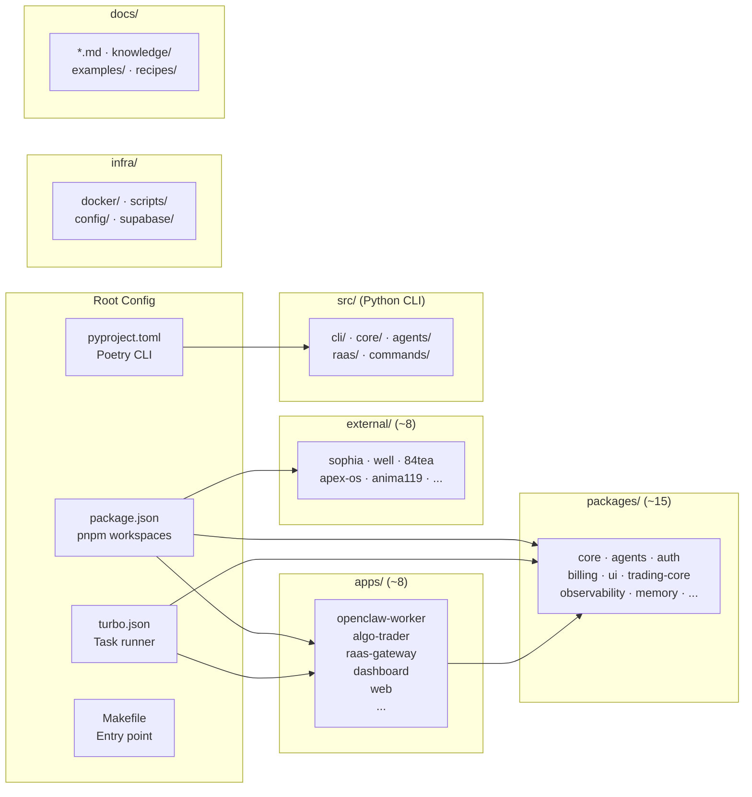

# Phase 5: Chuẩn Hóa Build System + Workspace Config

## Overview
- **Ưu tiên:** P2 MEDIUM
- **Trạng thái:** TODO
- **Mô tả:** Sau khi dọn dẹp, chuẩn hóa build pipeline, naming, và workspace config cho monorepo chuyên nghiệp.

## Vấn Đề Hiện Tại

### 1. Dual Package Manager Confusion
- `package.json` version `2.1.33` — `packageManager: pnpm@9.15.0`
- `pyproject.toml` version `3.0.0` — Poetry
- `pnpm-lock.yaml` (1.8MB) + `poetry.lock` (388KB)
- `requirements.txt` tồn tại riêng (trùng với poetry?)
- `setup.py` tồn tại (legacy — pyproject.toml đủ rồi)

### 2. Version Mismatch
- `package.json`: `2.1.33`
- `pyproject.toml`: `3.0.0`
- `VERSION` file: chưa kiểm tra
- Cần 1 single source of truth cho version

### 3. Workspace Config Phình
```yaml
# pnpm-workspace.yaml hiện tại
packages:
  - 'packages/*'
  - 'packages/core/*'
  - 'packages/integrations/*'
  - 'packages/business/*'
  - 'packages/ui/*'
  - 'packages/tooling/*'
  - 'apps/*'
```
Sau Phase 2 cắt tỉa, nhiều nested workspace paths sẽ không còn.

### 4. Turborepo Config
- `turbo.json` tồn tại nhưng cần kiểm tra pipeline config
- `tsconfig.base.json` + `tsconfig.json` — cần verify apps extend đúng

### 5. Scripts Root Quá Nhiều (215 files)
- Nhiều scripts có thể legacy/unused
- Không có naming convention rõ ràng
- Không phân loại theo mục đích

## Implementation Steps

### Bước 1: Thống Nhất Version
```bash
# 1 source of truth: VERSION file
echo "3.0.0" > VERSION

# pyproject.toml đọc từ VERSION
# package.json đọc từ VERSION
# Hoặc dùng script sync-version.sh
```

### Bước 2: Dọn Dẹp Package Managers
```bash
# Xóa legacy
rm setup.py              # pyproject.toml đủ rồi
rm requirements-vercel.txt  # Nếu không deploy Python lên Vercel
# Giữ requirements.txt CHỈ nếu cần cho non-poetry environments
```

### Bước 3: Chuẩn Hóa pnpm-workspace.yaml
```yaml
# Sau Phase 2+3+4, chỉ cần:
packages:
  - 'packages/*'
  - 'apps/*'
  - 'external/*'  # Nếu submodules cần workspace
```

### Bước 4: Chuẩn Hóa turbo.json Pipeline
```json
{
  "$schema": "https://turbo.build/schema.json",
  "tasks": {
    "build": {
      "dependsOn": ["^build"],
      "outputs": ["dist/**", ".next/**"]
    },
    "test": {
      "dependsOn": ["build"]
    },
    "lint": {},
    "dev": {
      "cache": false,
      "persistent": true
    }
  }
}
```

### Bước 5: Chuẩn Hóa tsconfig
```json
// tsconfig.base.json — shared config
{
  "compilerOptions": {
    "strict": true,
    "esModuleInterop": true,
    "skipLibCheck": true,
    "forceConsistentCasingInFileNames": true,
    "resolveJsonModule": true,
    "declaration": true,
    "declarationMap": true,
    "sourceMap": true
  }
}
```
Mỗi app/package phải `"extends": "../../tsconfig.base.json"`

### Bước 6: Phân Loại Scripts
```
infra/scripts/
├── build/           # Build-related scripts
├── deploy/          # Deployment scripts
├── dev/             # Development helpers
├── monitoring/      # Night monitor, health checks
├── proxy/           # Proxy management
└── setup/           # Setup & installation
```

### Bước 7: Chuẩn Hóa Package Naming
Mỗi package phải có `name` trong package.json theo pattern:
```
@mekong/core
@mekong/billing
@mekong/agents
@mekong/ui
@mekong/auth
@mekong/trading-core
```
Apps:
```
@mekong/openclaw-worker
@mekong/algo-trader
@mekong/dashboard
@mekong/web
```

### Bước 8: Tạo Makefile Thống Nhất
```makefile
# Root Makefile — single entry point
.PHONY: dev build test lint clean

dev:          ## Start all services
	pnpm dev

build:        ## Build all packages
	pnpm build

test:         ## Run all tests (Python + Node)
	python3 -m pytest && pnpm test

lint:         ## Lint all code
	ruff check src/ && pnpm lint

clean:        ## Clean build artifacts
	rm -rf dist/ build/ .turbo/ node_modules/.cache
```

## Kiến Trúc Cuối Cùng (Sau 5 Phases)



## Naming Convention (Toàn Monorepo)

| Loại | Convention | Ví dụ |
|------|-----------|-------|
| Directories | kebab-case | `algo-trader/`, `raas-gateway/` |
| JS/TS files | kebab-case | `brain-spawn-manager.js` |
| Python files | snake_case | `llm_client.py`, `kv_store_client.py` |
| Package names | @mekong/kebab-case | `@mekong/trading-core` |
| Config files | lowercase dots | `tsconfig.json`, `turbo.json` |
| Shell scripts | kebab-case | `proxy-recovery.sh` |
| Test files (Python) | test_snake_case | `test_raas_auth.py` |
| Test files (JS) | kebab-case.test | `circuit-breaker.test.js` |

## Todo List

- [ ] Thống nhất VERSION (1 source of truth)
- [ ] Xóa setup.py, requirements-vercel.txt
- [ ] Cập nhật pnpm-workspace.yaml
- [ ] Cập nhật turbo.json pipeline
- [ ] Chuẩn hóa tsconfig inheritance
- [ ] Phân loại 215 scripts
- [ ] Rename packages → @mekong/scope
- [ ] Cập nhật Makefile
- [ ] `pnpm install && pnpm build` verify
- [ ] `python3 -m pytest` verify
- [ ] Cập nhật CLAUDE.md kiến trúc mới

## Success Criteria

- 1 version, 1 build command, 1 test command
- Mọi package/app theo @mekong/ scope
- turbo.json pipeline đúng dependency order
- tsconfig inheritance rõ ràng
- scripts/ phân loại rõ ràng
- Full build + test pass
