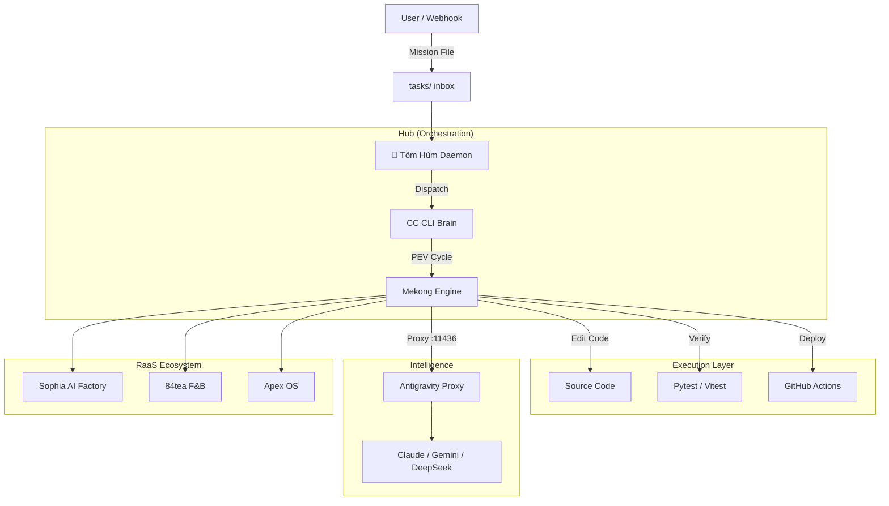

# Report: Documentation and DX Improvement Drafts

- Phase: documentation-improvement
- Plan: /Users/macbookprom1/mekong-cli/plans/260215-1349-opensource-raas-prep
- Status: in_progress

## Proposed README.md (English)

```markdown
# 🌊 Mekong CLI — RaaS Agency Operating System

<div align="center">


**The Revenue-as-a-Service (RaaS) Foundation for Autonomous AI Agencies.**
*Transforming service models into high-precision execution engines.*

[🚀 Quick Start](#-quick-start) • [📦 Architecture](#-architecture) • [💎 RaaS Foundation](#-raas-foundation) • [🎯 Features](#-features) • [🤝 Contributing](#-contributing) • [🇻🇳 Tiếng Việt](README.vi.md)

</div>

---

## 📖 Introduction

**Mekong CLI** is the central nervous system for **Revenue-as-a-Service (RaaS)** agencies. Inspired by **The Art of War (孫子兵法)**, it orchestrates specialized AI agents to plan, execute, and verify complex engineering and business tasks with 100% precision.

It bridges the gap between high-level strategic goals and low-level code execution, ensuring that every "mission" is completed according to strict quality gates.

## 🎯 Key Features

### 🧠 Autonomous Execution Engine (PEV)
The core **Plan-Execute-Verify** workflow ensures systematic task handling:
- **Plan**: Deep multi-step decomposition using reasoning models.
- **Execute**: Multi-mode execution (Shell, API, LLM) with self-healing capabilities.
- **Verify**: Strict Binh Phap quality gates (Type safety, No tech debt, Security audit).

### 🦞 Tôm Hùm (OpenClaw Daemon)
The autonomous orchestrator that keeps your agency running 24/7:
- **Autonomous Dispatch**: Watches `tasks/` directory and routes missions.
- **Auto-CTO**: Proactively cleans code, fixes types, and audits security during idle time.
- **M1 Protection**: Hardware-aware resource management for Apple Silicon devices.

### ⚡ Antigravity Proxy
A unified LLM gateway (`port 11436`) for cost-effective intelligence:
- **Load Balancing**: Distributes load across Ollama, OpenRouter, and direct providers.
- **Failover**: Automatic model switching (e.g., Sonnet to Gemini) during quota limits.
- **Optimization**: Smart routing based on task complexity.

---

## 📦 Architecture



---

## 💎 RaaS Foundation

Mekong CLI is designed for scalability, from solo developers to massive AI agencies.

| Feature | **Community** | **Enterprise (RaaS)** |
|---------|---------------|-----------------------|
| **Execution** | Local Edge (Mac/PC) | High-Performance Cloud GPU |
| **Model Access** | Flash / Haiku | Opus 4.5/4.6, R1, Pro |
| **Orchestration** | Sequential Agents | Massive Parallel Agent Teams |
| **Verification** | Manual validation | Automated "Green Production" |
| **Customization** | Public Recipes | Private Skills & Business Logic |

---

## 🚀 Quick Start

### 1. Prerequisites
- **Python**: 3.11+
- **Node.js**: 20+
- **pnpm**: 8+

### 2. Installation
```bash
git clone https://github.com/longtho638-jpg/mekong-cli.git
cd mekong-cli
pnpm install
pip install -r requirements.txt
cp .env.example .env
```

### 3. Launch the General
```bash
cd apps/openclaw-worker
npm run start
```

### 4. Deploy your first Mission
Create a file `tasks/mission_hello.txt`:
```text
- Project: mekong-cli
- Description: Say hello and check system health
- Instructions:
  1. Print "Mekong CLI Ready"
  2. Run unit tests to verify installation
```

---

## 🤝 Contributing

We follow **Binh Phap Standards**. Read our [Code Standards](./docs/code-standards.md) before submitting PRs.

---

<div align="center">
**Mekong CLI** © 2026 Binh Phap Venture Studio.
*"Speed is the essence of war."*
</div>
```

## Proposed README.vi.md (Vietnamese)

```markdown
# 🌊 Mekong CLI — Hệ Điều Hành RaaS Agency

<div align="center">


**Nền tảng Revenue-as-a-Service (RaaS) cho các AI Agency tự trị.**
*Biến mô hình dịch vụ thành cỗ máy thực thi chính xác cao.*

[🚀 Bắt Đầu Nhanh](#-bắt-đầu-nhanh) • [📦 Kiến Trúc](#-kiến-trúc) • [💎 RaaS Foundation](#-raas-foundation) • [🎯 Tính Năng](#-tính-năng) • [🌐 English](README.md)

</div>

---

## 📖 Giới Thiệu

**Mekong CLI** là hệ thần kinh trung ương cho các **RaaS Agency**. Lấy cảm hứng từ **Binh Pháp Tôn Tử**, hệ thống điều phối các AI agent chuyên biệt để lập kế hoạch, thực thi và kiểm tra các nhiệm vụ kỹ thuật phức tạp với độ chính xác 100%.

Mekong CLI xóa bỏ ranh giới giữa mục tiêu chiến lược và thực thi mã nguồn, đảm bảo mọi "nhiệm vụ" (mission) đều hoàn thành qua các cổng kiểm soát chất lượng nghiêm ngặt.

## 🎯 Tính Năng Nổi Bật

### 🧠 Engine Thực Thi Tự Trị (PEV)
Quy trình **Plan-Execute-Verify** (Mưu - Thực - Chứng):
- **Plan**: Phân rã nhiệm vụ sâu bằng các mô hình suy luận.
- **Execute**: Thực thi đa nền tảng với khả năng tự sửa lỗi (self-healing).
- **Verify**: Cổng chất lượng Binh Pháp (Type safety, No tech debt, Security).

### 🦞 Tôm Hùm (OpenClaw Daemon)
Điều phối viên tự trị hoạt động 24/7:
- **Autonomous Dispatch**: Giám sát thư mục `tasks/` và điều phối nhiệm vụ.
- **Auto-CTO**: Chủ động dọn dẹp code, fix type, và kiểm tra bảo mật khi rảnh.
- **M1 Protection**: Bảo vệ phần cứng, tối ưu RAM cho thiết bị Apple Silicon.

### ⚡ Antigravity Proxy
Cổng LLM tập trung (`port 11436`) tối ưu chi phí:
- **Cân bằng tải**: Phân bổ qua Ollama, OpenRouter và các provider trực tiếp.
- **Dự phòng (Failover)**: Tự động chuyển đổi model khi hết hạn ngạch.

---

## 🚀 Bắt Đầu Nhanh

### Cài đặt
```bash
git clone https://github.com/longtho638-jpg/mekong-cli.git
cd mekong-cli
pnpm install
pip install -r requirements.txt
```

### Khởi động Daemon
```bash
cd apps/openclaw-worker
npm run start
```

---
**Mekong CLI** © 2026 Binh Phap Venture Studio.
*"Binh quý thần tốc."*
```

## Proposed docs/raas-foundation.md

```markdown
# RaaS Foundation: Revenue-as-a-Service Infrastructure

## 1. Vision
The **Revenue-as-a-Service (RaaS)** model moves away from selling "hours" or "man-power" and moves toward selling **outcomes**. Mekong CLI is the infrastructure that makes this transition possible by automating the entire delivery lifecycle.

## 2. Antigravity Proxy: The Intelligence Hub
The Antigravity Proxy is a mission-critical component located at `port 11436`. It acts as a unified abstraction layer for LLMs.

### Key Capabilities:
- **Provider Agility**: Swap between Anthropic, Google AI, and local Ollama without changing code.
- **Resilience**: Implements the "Proxy Autonomy Protocol" — when one account hits a 429 (Rate Limit), it surgical-resets and fails over to another.
- **Latency Optimization**: Routes small logic checks to 3.5 Haiku/Flash while reserving complex refactoring for Opus/Pro.

## 3. Tôm Hùm: The Autonomous Operator
Tôm Hùm (OpenClaw) is the daemon that ensures the agency never sleeps. It transforms a static repository into a living service.

### Self-CTO Logic:
When no human missions are pending, Tôm Hùm initiates "Quality Campaigns":
1. **Scout**: Finds `console.log` or `TODO` comments.
2. **Fix**: Deploys a CC CLI session to clean them.
3. **Verify**: Runs tests to ensure no regressions.
4. **Commit**: Saves changes with a Binh Phap compliant message.

## 4. Scaling the Agency
- **Edge Node**: A single MacBook running Mekong CLI.
- **Swarm**: Multiple nodes connected via a central task queue.
- **Green Production**: Every change is verified by CI/CD and production smoke tests before being marked "Done".
```

## Mission Examples (tasks/examples/)

### mission_example_bugfix.txt
```text
- Project: mekong-cli
- Priority: HIGH
- Description: Fix the infinite loop in RecipeExecutor when a shell command fails with specific error code 137.
- Instructions:
  1. Reproduce with a test case in tests/test_executor.py.
  2. Implement a retry limit and graceful failure.
  3. Verify CI is GREEN.
```

### mission_example_feature.txt
```text
- Project: apps/sophia-ai-factory
- Priority: MEDIUM
- Description: Implement Polar.sh webhook handler for 'subscription.created' event.
- Instructions:
  1. Create a new API route `/api/webhooks/polar`.
  2. Map Polar data to our Subscription table in Supabase.
  3. Send a welcome email via Resend.
  4. Use `/preview --diagram` to show the flow.
```
