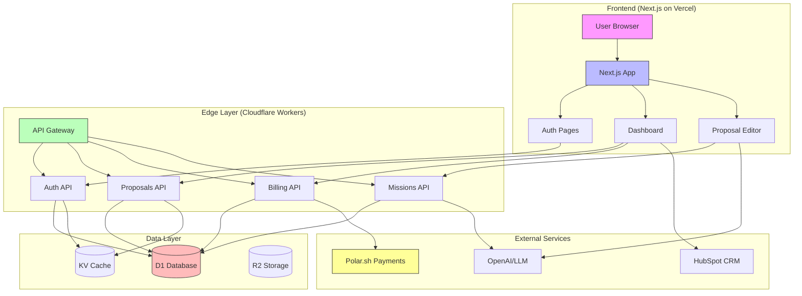

# Sophia AI Factory - Architecture Design Research

> **Goal:** $1M ARR by Q2 2027 | Currently Sprint 1 (Auth + Onboarding)
> **Target:** 6 weeks to 10 pilots, $5K MRR
> **Stack:** Next.js/Node.js + Vercel/Cloudflare + Polar.sh payments

---

## 1. Current Architecture State

### 1.1 Existing Codebase Analysis

**Location:** `apps/sophia-factory/` and `apps/sophia-proposal/`

| Component | Current State | Tech |
|-----------|---------------|------|
| Frontend | Next.js 14 App Router | React 18, Tailwind, shadcn/ui |
| Database | Supabase (PostgreSQL) | Cloud D1 (SQLite) alternative |
| Auth | Supabase Auth | Email/password + OAuth |
| Payments | Polar.sh webhooks | Credit-based MCU billing |
| API Routes | Next.js API routes | /api/auth, /api/proposals |
| AI Engine | OpenAI SDK | Proposal generation |
| CRM | Hubspot integration | Sync clients/deals |

### 1.2 Existing Database Schema (Supabase)

```sql
-- Core tables from apps/sophia-proposal/lib/db/migrations/0001-init.sql
users (id, email, password_hash, full_name, avatar_url, role, email_verified, ...)
organizations (id, name, slug, plan, settings, ...)
org_members (org_id, user_id, role)
subscriptions (org_id, polar_subscription_id, plan, status, ...)
proposals (org_id, user_id, title, content, status, ...)
missions (org_id, title, command, params, status, mcu_cost, ...)
```

### 1.3 Current Auth Implementation

**Issue:** Mixed patterns detected:
- `sophia-factory` uses Supabase client directly in components
- `sophia-proposal` has custom Context-based auth provider
- No unified session management
- No rate limiting on auth endpoints

```tsx
// Current pattern (sophia-proposal/components/auth/auth-provider.tsx)
// Stores session in localStorage (SECURITY RISK!)
localStorage.setItem(STORAGE_KEY, JSON.stringify(user));
```

---

## 2. Authentication Architecture

### 2.1 Options Comparison

| Criteria | Supabase Auth | Better Auth | Auth0 | Clerk |
|----------|---------------|-------------|-------|-------|
| **Cost (10K users)** | Free | Free (self-hosted) | $25/mo | $25/mo |
| **Setup Time** | 1 hour | 2-3 hours | 30 min | 30 min |
| **Customization** | Limited | Full control | Limited | Limited |
| **Data Ownership** | Supabase cloud | Your database | Auth0 cloud | Clerk cloud |
| **Edge Support** | Limited | Full (Cloudflare) | Limited | Limited |
| **Multi-tenancy** | Manual | Plugin system | Enterprise | Built-in |
| **Vendor Lock-in** | High | None | High | High |
| **Migration Effort** | N/A (current) | Medium | High | High |

### 2.2 Recommendation: **Better Auth**

**Why:**
1. **YAGNI/KISS:** We already have Supabase working for MVP
2. **DRY:** Single codebase for auth logic (no SDK abstraction layers)
3. **Cloudflare-first:** Edge Functions native support
4. **No vendor lock-in:** Full control over data and migrations
5. **Plugin ecosystem:** Organizations, 2FA, passkeys when needed

**Migration Path:**
```
Phase 1 (Sprint 1-2): Keep Supabase Auth for MVP
Phase 2 (Sprint 3-4): Add Better Auth alongside (dual auth)
Phase 3 (Sprint 5-6): Migrate users, deprecate Supabase Auth
```

### 2.3 Recommended Auth Architecture

```
┌─────────────────────────────────────────────────────────┐
│                    Frontend (Next.js)                    │
│  ┌──────────┐  ┌──────────┐  ┌──────────┐              │
│  │  Login   │  │  Signup  │  │  Magic   │              │
│  │  Form    │  │  Form    │  │  Link    │              │
│  └────┬─────┘  └────┬─────┘  └────┬─────┘              │
│       │             │             │                     │
│       └─────────────┴─────────────┘                     │
│                     │                                   │
│              useAuth() Hook                             │
└─────────────────────┼───────────────────────────────────┘
                      │
                      ▼
┌─────────────────────────────────────────────────────────┐
│               API Routes (/api/auth/[...all])            │
│                    Better Auth Handler                   │
│  ┌─────────────────────────────────────────────────┐   │
│  │  Auth Server (auth.ts)                          │   │
│  │  - Email/Password                               │   │
│  │  - OAuth (Google, GitHub)                       │   │
│  │  - Magic Link                                   │   │
│  │  - Session Management                           │   │
│  │  - Rate Limiting (built-in)                     │   │
│  └─────────────────────────────────────────────────┘   │
└─────────────────────┬───────────────────────────────────┘
                      │
                      ▼
┌─────────────────────────────────────────────────────────┐
│              Database (Cloudflare D1)                    │
│  ┌──────────┐  ┌──────────┐  ┌──────────┐              │
│  │  users   │  │ sessions │  │accounts  │              │
│  │  table   │  │  table   │  │  table   │              │
│  └──────────┘  └──────────┘  └──────────┘              │
└─────────────────────────────────────────────────────────┘
```

---

## 3. Database Schema Design

### 3.1 Recommended Schema (Cloudflare D1 - SQLite)

**Rationale:**
- $0 base cost (vs Supabase $25/mo after free tier)
- Edge-native (Cloudflare Workers)
- No cold starts
- Full SQL support

```sql
-- ============================================================================
-- CORE AUTH & ORGS
-- ============================================================================

CREATE TABLE users (
  id TEXT PRIMARY KEY DEFAULT (lower(hex(randomblob(16)))),
  email TEXT UNIQUE NOT NULL,
  password_hash TEXT,
  full_name TEXT,
  avatar_url TEXT,
  role TEXT DEFAULT 'user' CHECK(role IN ('user', 'admin', 'owner')),
  email_verified INTEGER DEFAULT 0,
  magic_link_token TEXT,
  magic_link_expires_at TEXT,
  last_sign_in_at TEXT,
  created_at TEXT DEFAULT (datetime('now')),
  updated_at TEXT DEFAULT (datetime('now'))
);

CREATE TABLE organizations (
  id TEXT PRIMARY KEY DEFAULT (lower(hex(randomblob(16)))),
  name TEXT NOT NULL,
  slug TEXT UNIQUE NOT NULL,
  plan TEXT DEFAULT 'free' CHECK(plan IN ('free', 'starter', 'growth', 'premium', 'enterprise')),
  settings TEXT DEFAULT '{}', -- JSON
  stripe_customer_id TEXT,
  polar_customer_id TEXT,
  created_at TEXT DEFAULT (datetime('now')),
  updated_at TEXT DEFAULT (datetime('now'))
);

CREATE TABLE org_members (
  id TEXT PRIMARY KEY DEFAULT (lower(hex(randomblob(16)))),
  org_id TEXT NOT NULL REFERENCES organizations(id) ON DELETE CASCADE,
  user_id TEXT NOT NULL REFERENCES users(id) ON DELETE CASCADE,
  role TEXT DEFAULT 'member' CHECK(role IN ('member', 'admin', 'owner')),
  created_at TEXT DEFAULT (datetime('now')),
  UNIQUE(org_id, user_id)
);

-- ============================================================================
-- BETTER AUTH TABLES (auto-generated by npx @better-auth/cli generate)
-- ============================================================================

CREATE TABLE accounts (
  id TEXT PRIMARY KEY,
  user_id TEXT NOT NULL REFERENCES users(id),
  provider_id TEXT NOT NULL,
  provider_account_id TEXT NOT NULL,
  access_token TEXT,
  refresh_token TEXT,
  expires_at TEXT,
  created_at TEXT DEFAULT (datetime('now')),
  updated_at TEXT DEFAULT (datetime('now')),
  UNIQUE(provider_id, provider_account_id)
);

CREATE TABLE sessions (
  id TEXT PRIMARY KEY,
  user_id TEXT NOT NULL REFERENCES users(id) ON DELETE CASCADE,
  expires_at TEXT NOT NULL,
  ip_address TEXT,
  user_agent TEXT,
  created_at TEXT DEFAULT (datetime('now')),
  updated_at TEXT DEFAULT (datetime('now'))
);

CREATE TABLE verifications (
  id TEXT PRIMARY KEY,
  identifier TEXT NOT NULL,
  value TEXT NOT NULL,
  expires_at TEXT NOT NULL,
  created_at TEXT DEFAULT (datetime('now')),
  updated_at TEXT DEFAULT (datetime('now'))
);

-- ============================================================================
-- BILLING & SUBSCRIPTIONS (Polar.sh)
-- ============================================================================

CREATE TABLE subscriptions (
  id TEXT PRIMARY KEY DEFAULT (lower(hex(randomblob(16)))),
  org_id TEXT NOT NULL REFERENCES organizations(id) ON DELETE CASCADE,
  polar_subscription_id TEXT UNIQUE,
  polar_order_id TEXT,
  plan TEXT DEFAULT 'free',
  status TEXT DEFAULT 'active' CHECK(status IN ('active', 'cancelled', 'expired', 'trialing')),
  current_period_start TEXT,
  current_period_end TEXT,
  cancel_at_period_end INTEGER DEFAULT 0,
  cancelled_at TEXT,
  created_at TEXT DEFAULT (datetime('now')),
  updated_at TEXT DEFAULT (datetime('now'))
);

CREATE TABLE org_balances (
  id TEXT PRIMARY KEY DEFAULT (lower(hex(randomblob(16)))),
  org_id TEXT UNIQUE NOT NULL REFERENCES organizations(id) ON DELETE CASCADE,
  balance REAL DEFAULT 0,
  currency TEXT DEFAULT 'USD',
  last_charge_at TEXT,
  created_at TEXT DEFAULT (datetime('now')),
  updated_at TEXT DEFAULT (datetime('now'))
);

CREATE TABLE usage_logs (
  id TEXT PRIMARY KEY DEFAULT (lower(hex(randomblob(16)))),
  org_id TEXT NOT NULL,
  feature TEXT NOT NULL,
  model_name TEXT,
  quantity REAL DEFAULT 1,
  unit TEXT DEFAULT 'calls',
  mcu_cost REAL DEFAULT 0,
  metadata TEXT DEFAULT '{}',
  created_at TEXT DEFAULT (datetime('now'))
);

-- Index for billing queries
CREATE INDEX idx_usage_logs_org_date ON usage_logs(org_id, created_at DESC);
CREATE INDEX idx_usage_logs_feature ON usage_logs(feature);

-- ============================================================================
-- PROPOSALS (Core Product)
-- ============================================================================

CREATE TABLE proposals (
  id TEXT PRIMARY KEY DEFAULT (lower(hex(randomblob(16)))),
  org_id TEXT NOT NULL REFERENCES organizations(id) ON DELETE CASCADE,
  user_id TEXT REFERENCES users(id),
  title TEXT NOT NULL,
  content TEXT, -- JSON content
  status TEXT DEFAULT 'draft' CHECK(status IN ('draft', 'review', 'sent', 'viewed', 'accepted', 'rejected')),
  client_email TEXT,
  client_name TEXT,
  value REAL,
  currency TEXT DEFAULT 'USD',
  metadata TEXT DEFAULT '{}',
  video_url TEXT,
  pdf_url TEXT,
  public_slug TEXT UNIQUE,
  viewed_at TEXT,
  created_at TEXT DEFAULT (datetime('now')),
  updated_at TEXT DEFAULT (datetime('now'))
);

CREATE INDEX idx_proposals_org ON proposals(org_id, created_at DESC);
CREATE INDEX idx_proposals_status ON proposals(status);

-- ============================================================================
-- MISSIONS (OpenClaw PEV Engine)
-- ============================================================================

CREATE TABLE missions (
  id TEXT PRIMARY KEY DEFAULT (lower(hex(randomblob(16)))),
  org_id TEXT NOT NULL REFERENCES organizations(id) ON DELETE CASCADE,
  title TEXT NOT NULL,
  command TEXT NOT NULL,
  params TEXT DEFAULT '{}',
  priority TEXT DEFAULT 'normal',
  status TEXT DEFAULT 'queued' CHECK(status IN ('queued', 'running', 'completed', 'failed', 'cancelled')),
  result TEXT,
  error_message TEXT,
  mcu_cost REAL DEFAULT 0,
  mcu_reserved REAL DEFAULT 0,
  webhook_url TEXT,
  parent_mission_id TEXT REFERENCES missions(id),
  started_at TEXT,
  completed_at TEXT,
  created_at TEXT DEFAULT (datetime('now')),
  updated_at TEXT DEFAULT (datetime('now'))
);

-- ============================================================================
-- ONBOARDING (Pilot Program)
-- ============================================================================

CREATE TABLE onboarding_progress (
  id TEXT PRIMARY KEY DEFAULT (lower(hex(randomblob(16)))),
  org_id TEXT NOT NULL REFERENCES organizations(id) ON DELETE CASCADE,
  user_id TEXT REFERENCES users(id),
  step TEXT NOT NULL,
  status TEXT DEFAULT 'pending' CHECK(status IN ('pending', 'in_progress', 'completed', 'skipped')),
  data TEXT DEFAULT '{}',
  completed_at TEXT,
  created_at TEXT DEFAULT (datetime('now')),
  updated_at TEXT DEFAULT (datetime('now')),
  UNIQUE(org_id, step)
);

-- ============================================================================
-- INDEXES FOR PERFORMANCE
-- ============================================================================

CREATE INDEX IF NOT EXISTS idx_users_email ON users(email);
CREATE INDEX IF NOT EXISTS idx_org_members_user ON org_members(user_id);
CREATE INDEX IF NOT EXISTS idx_org_members_org ON org_members(org_id);
CREATE INDEX IF NOT EXISTS idx_subscriptions_org ON subscriptions(org_id);
CREATE INDEX IF NOT EXISTS idx_subscriptions_status ON subscriptions(status);
CREATE INDEX IF NOT EXISTS idx_missions_org_status ON missions(org_id, status);
```

### 3.2 Multi-tenancy Strategy

**Approach:** Row-Level Security (RLS) via application logic

**Pattern:**
```typescript
// Every query MUST include org_id filter
const proposals = await db
  .select()
  .from(proposals)
  .where(eq(proposals.org_id, session.org_id)); // NEVER omit

// Middleware enforces org context
export async function orgMiddleware(req, res, next) {
  const session = await getSession(req);
  if (!session?.org_id) {
    return res.status(401).json({ error: 'No organization context' });
  }
  req.orgId = session.org_id;
  next();
}
```

**Data Isolation Levels:**

| Level | Implementation | Use Case |
|-------|----------------|----------|
| Logical | `WHERE org_id = ?` | Standard SaaS |
| Physical | Separate databases | Enterprise |
| Hybrid | Shared + isolated tables | Multi-product |

**Recommendation:** Start with Logical (YAGNI), add Physical for Enterprise tier.

---

## 4. Edge Functions Architecture

### 4.1 Cloudflare Workers Setup

**Why Cloudflare over Vercel Edge:**
- 100ms cold start (vs Vercel 500ms+)
- $0 base cost (100K requests/day free)
- D1 database native integration
- KV/R2 for caching/storage
- Same deployment pipeline

### 4.2 API Structure

```
apps/sophia-factory/
├── src/
│   ├── app/
│   │   ├── api/
│   │   │   ├── auth/
│   │   │   │   └── [...all]/
│   │   │   │       └── route.ts  # Better Auth handler
│   │   │   ├── proposals/
│   │   │   │   ├── route.ts      # GET list, POST create
│   │   │   │   └── [id]/
│   │   │   │       └── route.ts  # GET/PUT/DELETE
│   │   │   ├── billing/
│   │   │   │   ├── checkout/
│   │   │   │   │   └── route.ts  # Create Polar checkout
│   │   │   │   ├── webhook/
│   │   │   │   │   └── route.ts  # Polar webhook handler
│   │   │   │   └── usage/
│   │   │   │       └── route.ts  # GET usage stats
│   │   │   ├── missions/
│   │   │   │   └── route.ts      # POST execute mission
│   │   │   └── onboarding/
│   │   │       └── route.ts      # GET/POST onboarding steps
```

### 4.3 Edge Function Example

```typescript
// src/app/api/proposals/route.ts
import { auth } from '@/lib/auth';
import { db } from '@/lib/db';
import { proposals } from '@/db/schema';
import { NextRequest, NextResponse } from 'next/server';

export async function GET(req: NextRequest) {
  const session = await auth.api.getSession({ headers: req.headers });
  if (!session) return NextResponse.json({ error: 'Unauthorized' }, { status: 401 });

  const orgId = session.org_id;
  const orgProposals = await db
    .select()
    .from(proposals)
    .where(eq(proposals.org_id, orgId))
    .orderBy(proposals.created_at, 'desc');

  return NextResponse.json(orgProposals);
}

export async function POST(req: NextRequest) {
  const session = await auth.api.getSession({ headers: req.headers });
  if (!session) return NextResponse.json({ error: 'Unauthorized' }, { status: 401 });

  const body = await req.json();
  const newProposal = await db.insert(proposals).values({
    org_id: session.org_id,
    user_id: session.user.id,
    title: body.title,
    content: body.content,
    status: 'draft',
  }).returning();

  return NextResponse.json(newProposal[0], { status: 201 });
}
```

---

## 5. Payment Integration (Polar.sh)

### 5.1 Architecture

```
┌──────────────────────────────────────────────────────────┐
│                  Customer Checkout                        │
│  ┌─────────┐    ┌─────────┐    ┌─────────┐             │
│  │ Starter │    │ Growth  │    │ Premium │             │
│  │  $49/mo│    │$149/mo  │    │$499/mo  │             │
│  └────┬────┘    └────┬────┘    └────┬────┘             │
│       │             │             │                     │
│       └─────────────┴─────────────┘                     │
│                     │                                   │
│              Polar Checkout                             │
└─────────────────────┼───────────────────────────────────┘
                      │
                      ▼
┌──────────────────────────────────────────────────────────┐
│              Polar Webhook Handler                        │
│  ┌──────────────────────────────────────────────────┐  │
│  │  /api/billing/webhook                            │  │
│  │  - subscription.created → Provision credits     │  │
│  │  - subscription.updated → Update tier           │  │
│  │  - subscription.cancelled → Downgrade to free   │  │
│  │  - order.created → One-time credit top-up       │  │
│  └──────────────────────────────────────────────────┘  │
└─────────────────────┬───────────────────────────────────┘
                      │
                      ▼
┌──────────────────────────────────────────────────────────┐
│               Credit Account Repo                         │
│  - Add credits to org_balance                            │
│  - Update subscription tier                              │
│  - Log transaction                                       │
└───────────────────────────────────────────────────────────┘
```

### 5.2 Webhook Handler (Existing Code)

From `src/raas/polar_webhook_handler.py`:

```python
class PolarWebhookHandler:
    def handle_event(self, event_data: dict) -> bool:
        event_type = event_data.get("type", "")

        if event_type == "subscription.created":
            return self._handle_subscription_created(event_data)
        elif event_type == "subscription.updated":
            return self._handle_subscription_updated(event_data)
        elif event_type == "subscription.cancelled":
            return self._handle_subscription_cancelled(event_data)
```

### 5.3 Recommended MCU Pricing

| Tier | Price/mo | MCU Credits | API Calls | Proposals/mo |
|------|----------|-------------|-----------|--------------|
| Free | $0 | 50 | 100 | 3 |
| Starter | $49 | 500 | 2,000 | 20 |
| Growth | $149 | 2,000 | 10,000 | 100 |
| Premium | $499 | 10,000 | 50,000 | 500 |
| Enterprise | Custom | Custom | Custom | Custom |

**Overage:** $0.10 per 100 MCU after quota

---

## 6. Security Considerations

### 6.1 Critical Security Gaps (Current)

| Issue | Severity | Fix |
|-------|----------|-----|
| localStorage session storage | HIGH | Use HTTP-only cookies |
| No CSRF protection | HIGH | Add CSRF tokens |
| No rate limiting on auth | MEDIUM | Enable Better Auth rate limiting |
| No audit logging | MEDIUM | Add auth event logging |
| API keys in client bundle | LOW | Move to server-side |

### 6.2 Security Headers

```typescript
// next.config.js
module.exports = {
  headers: async () => [
    {
      source: '/:path*',
      headers: [
        { key: 'X-DNS-Prefetch-Control', value: 'on' },
        { key: 'Strict-Transport-Security', value: 'max-age=63072000; includeSubDomains; preload' },
        { key: 'X-Frame-Options', value: 'SAMEORIGIN' },
        { key: 'X-Content-Type-Options', value: 'nosniff' },
        { key: 'X-XSS-Protection', value: '1; mode=block' },
        { key: 'Referrer-Policy', value: 'strict-origin-when-cross-origin' },
        { key: 'Permissions-Policy', value: 'camera=(), microphone=(), geolocation=()' },
        { key: 'Content-Security-Policy', value: "default-src 'self'; script-src 'self' 'unsafe-inline'; style-src 'self' 'unsafe-inline';" }
      ]
    }
  ]
}
```

### 6.3 RLS (Row Level Security) Policy

Even though we use application-level filtering, add database-level RLS:

```sql
-- Enable RLS on all tables
ALTER TABLE proposals ENABLE ROW LEVEL SECURITY;

-- Policy: Users can only see their org's data
CREATE POLICY org_isolation ON proposals
  FOR ALL
  USING (org_id = current_setting('app.current_org_id')::uuid);
```

---

## 7. Performance Targets

### 7.1 SLA Targets

| Metric | Target | Measurement |
|--------|--------|-------------|
| TTFB | < 200ms | Web Vitals |
| LCP | < 2.5s | Web Vitals |
| FID | < 100ms | Web Vitals |
| API P95 | < 500ms | Cloudflare Analytics |
| Database P95 | < 100ms | D1 Analytics |
| Build Time | < 30s | GitHub Actions |
| Deploy Time | < 60s | Vercel/CF |

### 7.2 Caching Strategy

```
┌─────────────────────────────────────────────────────────┐
│                 CDN Cache (Cloudflare)                   │
│  - Static assets: 1 year                                 │
│  - HTML pages: 5 min (stale-while-revalidate 1h)        │
│  - API responses: No cache (auth required)              │
└─────────────────────────────────────────────────────────┘
                          │
                          ▼
┌─────────────────────────────────────────────────────────┐
│              Edge Cache (Cloudflare KV)                  │
│  - Session data: 24h TTL                                │
│  - Rate limit counters: 1 min TTL                       │
│  - Usage aggregates: 5 min TTL                          │
└─────────────────────────────────────────────────────────┘
                          │
                          ▼
┌─────────────────────────────────────────────────────────┐
│               Database (Cloudflare D1)                   │
│  - Hot data in memory (SQLite)                          │
│  - Cold data on disk                                    │
└─────────────────────────────────────────────────────────┘
```

### 7.3 Database Query Optimization

```typescript
// BAD: N+1 queries
const proposals = await db.select().from(proposals);
for (const p of proposals) {
  p.user = await db.select().from(users).where(eq(users.id, p.user_id));
}

// GOOD: JOIN in single query
const proposals = await db
  .select({
    proposal: proposals,
    user: users,
  })
  .from(proposals)
  .leftJoin(users, eq(proposals.user_id, users.id))
  .where(eq(proposals.org_id, orgId));
```

---

## 8. Recommended Architecture Diagram



---

## 9. Implementation Phases

### Phase 1: Auth Foundation (Week 1-2)
- [ ] Install Better Auth
- [ ] Create D1 database
- [ ] Run schema migrations
- [ ] Mount API handler
- [ ] Create auth client hooks
- [ ] Build login/signup UI

### Phase 2: Organization Context (Week 2-3)
- [ ] Org creation flow
- [ ] Org switcher component
- [ ] Invite members feature
- [ ] RBAC (roles: owner/admin/member)

### Phase 3: Billing Integration (Week 3-4)
- [ ] Create Polar products
- [ ] Build checkout flow
- [ ] Implement webhook handler
- [ ] Credit provisioning
- [ ] Usage tracking

### Phase 4: Onboarding (Week 4-5)
- [ ] Onboarding progress tracker
- [ ] Pilot checklist
- [ ] Welcome email sequence
- [ ] NPS survey

### Phase 5: Hardening (Week 5-6)
- [ ] Security audit
- [ ] Performance testing
- [ ] Error handling (Sentry)
- [ ] Monitoring (logging)
- [ ] Backup strategy

---

## 10. Unresolved Questions

1. **Email Provider:** Which service for transactional emails? (Resend, SendGrid, Postmark)
2. **Video Hosting:** HeyGen API or self-hosted for proposal videos?
3. **PDF Generation:** Server-side (Puppeteer) or client-side (react-pdf)?
4. **Analytics:** PostHog self-hosted or cloud?
5. **Error Tracking:** Sentry vs Self-hosted (GlitchTip)?
6. **Search:** Need full-text search on proposals? (D1 FT5 extension)
7. **Real-time:** Need live collaboration on proposals? (Yjs + Hocuspocus)

---

## Appendix A: File Paths Reference

| File | Purpose |
|------|---------|
| `apps/sophia-factory/src/lib/auth.ts` | Better Auth server config |
| `apps/sophia-factory/src/lib/auth-client.ts` | Better Auth client |
| `apps/sophia-factory/src/lib/db.ts` | D1 database connection |
| `apps/sophia-factory/src/db/schema.ts` | Drizzle ORM schema |
| `apps/sophia-factory/src/app/api/auth/[...all]/route.ts` | Auth API handler |
| `apps/sophia-factory/src/middleware.ts` | Auth middleware |
| `apps/sophia-factory/src/components/auth/` | Auth UI components |

---

## Appendix B: Environment Variables

```env
# Auth
BETTER_AUTH_SECRET=your-secret-key-min-32-chars
BETTER_AUTH_URL=http://localhost:3000
NEXT_PUBLIC_BETTER_AUTH_URL=http://localhost:3000

# Database (Cloudflare D1)
D1_DATABASE_ID=your-d1-database-id

# Polar.sh
POLAR_ACCESS_TOKEN=polar_xxx
POLAR_WEBHOOK_SECRET=whsec_xxx
NEXT_PUBLIC_POLAR_CHECKOUT_URL=https://buy.polar.sh/your-checkout

# Email (Resend)
RESEND_API_KEY=re_xxx

# Analytics (Optional)
SENTRY_DSN=https://xxx@oxxx.ingest.sentry.io/xxx
POSTHOG_HOST=https://app.posthog.com
POSTHOG_API_KEY=phc_xxx
```

---

_Research completed: 2026-03-22_
_Next step: Create implementation plan in `plans/260322-{slug}/`_
